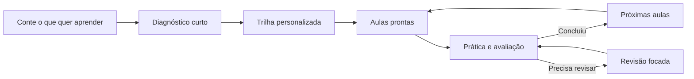

# Open Study Path

Template open source para criar trilhas de estudo personalizadas com Claude e GitHub Actions.

> Este repositório é o template. Cada pessoa cria um repositório próprio a partir dele para guardar sua trilha, aulas, avaliações e progresso.

## O que a experiência entrega

Uma trilha possui:

- um mapa completo do caminho de aprendizagem;
- etapas pequenas, com objetivo e tempo sugerido;
- aulas autocontidas com explicações, exemplos, prática e diagramas;
- fontes verificáveis e formas alternativas de aprender;
- avaliações com feedback e revisão focada;
- integração opcional com tarefas, agenda e outras ferramentas.

As próximas aulas podem ser preparadas conforme a pessoa avança. Isso permite adaptar exemplos, fontes e prática a partir das avaliações anteriores.

## Conteúdo com fontes

Cada aula pronta deve mostrar:

- de onde vieram as ideias principais;
- quais partes são síntese ou adaptação pedagógica;
- fontes primárias, oficiais, acadêmicas ou técnicas;
- artigos, livros, papers, TCCs ou dissertações quando pertinentes;
- vídeos, aulas abertas, podcasts, demonstrações ou cursos quando acrescentarem valor;
- capítulo, seção, página, versão, aula, exercício ou timestamp preciso.

Uma resposta de plugin ou um resultado de busca não é uma fonte final. O módulo registra o documento original e explica como ele foi usado. Recursos pagos nunca são o único caminho.

Veja `docs/content-quality-and-sources.md`.

## Revisão independente

Tudo o que uma instância gera ou altera passa por um papel revisor antes de a operação ser considerada concluída.

Há revisores especializados para configuração, intake, diagnóstico, currículo, publicação, avaliação, progresso, replanejamento e migração. A autoria e a revisão acontecem em passes separados, mesmo quando o mesmo runtime executa os dois.

A revisão procura contradições entre o pedido, os artefatos produzidos, o estado persistido e as ferramentas externas. Cada aprovação registra os arquivos exatos revisados e suas versões em `state/reviews/`. Mudanças sem revisão, cobertura parcial, aprovação antiga ou achado bloqueante impedem o merge.

A revisão de aulas continua mais profunda: cada resultado prometido precisa ser realmente ensinado e avaliado, com evidência versionada em `state/content-reviews/`.

Veja `docs/review-framework.md`.

## Linguagem voltada para quem estuda

O GitHub continua usando PRs, CI e arquivos de estado internamente, mas a conversa principal não precisa parecer um relatório de engenharia.

Depois de uma operação bem-sucedida, a pessoa recebe:

1. o que ficou pronto;
2. o link necessário agora;
3. o próximo passo;
4. uma frase curta para continuar.

Números de PR, hashes, branches, jobs de CI e classificações internas aparecem somente quando solicitados ou quando explicam um bloqueio.

Veja `docs/learner-facing-language.md`.

## Começar uma nova trilha

1. Use este template para criar um repositório próprio.
2. Adicione sua `ANTHROPIC_API_KEY` como Secret do repositório novo (**Settings -> Secrets and variables -> Actions**) e defina um limite de gasto para ela no Console da Anthropic.
3. Na aba **Actions**, rode o workflow **Agent pilot** com `phase: bootstrap_instance` e `target_repo` igual ao `owner/repositório` do seu próprio repositório novo.
4. Revise e mergeie a pull request que o workflow abre. Ela cria `.open-study-path/instance.yml` e prepara o formulário de entrada.
5. Rode **Agent pilot** de novo com `phase: configure_intake` (mesmo `target_repo`). Ao terminar, a PR devolve o link direto do formulário.
6. Preencha o formulário no link devolvido.
7. Rode **Agent pilot** com `phase: intake` para importar sua resposta.

Depois disso, cada fase seguinte (`diagnostic`, `generate_proposal`, `generate_detailed`, `publish`, `evaluate`, `track`, `replan`) é a mesma coisa: escolher a fase no dropdown do workflow **Agent pilot** e rodar. `diagnostic` é a exceção — ele já roda sozinho por comentário na issue de sessão que a fase anterior cria, sem precisar disparar o workflow manualmente a cada pergunta.

O texto natural que a pessoa digitaria numa conversa continua valendo como o conteúdo de `extra_context` ao disparar a próxima fase, por exemplo:

```text
Terminei <título da aula>. Avalie minhas respostas.
```

Veja `docs/claude-agent-setup.md` para o passo a passo completo, as restrições atuais de cada fase (por exemplo: só o provedor `github_issue` de intake e só o backend `GitHub Issues` de tarefas estão automatizados por enquanto) e `docs/claude-agent-pilot.md` para o design completo.

## Ciclo de aprendizagem



O mapa completo é criado desde o início. Em trilhas maiores, apenas as primeiras aulas ficam prontas de imediato. As demais são preparadas automaticamente quando os pré-requisitos são concluídos.

## Estrutura da trilha

- `study/roadmap.md` — visão completa e sequência;
- `study/topics/` — visão resumida de cada etapa;
- `study/modules/` — aulas completas;
- `study/assessments/` — rubricas;
- `.github/ISSUE_TEMPLATE/` — formulários de entrada e avaliação;
- `study/integrations.md` — ferramentas que podem ajudar;
- `state/reviews/` — revisões independentes das operações;
- `state/content-reviews/` — revisão semântica das aulas materializadas;
- `state/` — registros técnicos de progresso e integrações.

## Aprendizagem visual

O roadmap mostra as dependências reais em Mermaid. Cada aula pronta possui ao menos um diagrama útil e explicado. Diagramas podem representar decisões, sequências, estados, relações, arquitetura, dados ou cronologia.

Veja `docs/mermaid-visual-learning.md`.

## Integrações por necessidade

Ferramentas externas são escolhidas pelo valor que oferecem, não por estarem disponíveis.

| Necessidade | Possível ferramenta | Alternativa local |
| --- | --- | --- |
| Tarefas | Trello ou Todoist | GitHub ou Markdown |
| Agenda | Reclaim, Google ou Outlook | projeção semanal |
| Pesquisa acadêmica | Consensus | fontes originais e web |
| Diagramas externos | Whimsical | Mermaid |
| Entregáveis | Google Drive | arquivos do repositório |
| Analytics | Airtable | arquivos de estado |

Só uma ferramenta de tarefas mantém o acompanhamento principal. Agenda, hábitos e cursos ajudam, mas não concluem uma etapa.

Os recursos externos são indexados em `state/integrations.json` para evitar duplicações. Veja `docs/integration-capabilities.md`.

## Avaliação

Cada aula pronta possui um formulário com cinco questões e uma rubrica de 100 pontos. A pessoa responde com o próprio raciocínio, recebe feedback e, quando necessário, uma revisão focada.

O comando recomendado usa o título da aula:

```text
Terminei Agência sem garantia. Avalie minhas respostas.
```

O agente localiza a submissão correta sem exigir o número da issue na situação normal.

## Princípios

- a aula ensina; não é uma lista de links;
- as fontes são verificadas e explicadas;
- exemplos e atividades são personalizados sem expor dados desnecessários;
- toda operação gerada passa por revisão independente;
- ferramentas opcionais nunca bloqueiam o caminho principal;
- conteúdo e avaliações ficam versionados no GitHub;
- detalhes técnicos ficam disponíveis sem ocupar a conversa principal;
- nenhuma credencial ou submissão bruta é versionada.
