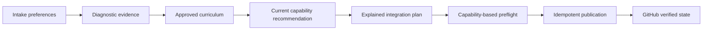
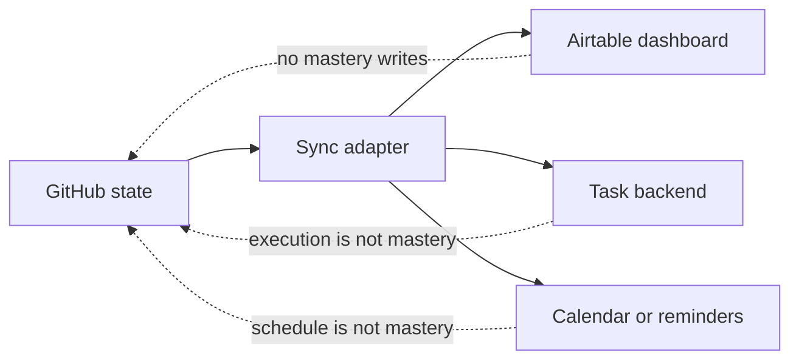

# Capability-based integrations

Open Study Path selects integrations from current learning actions rather than maintaining a fixed list of apps. GitHub remains the source of truth for curriculum, content, assessment, mastery and verified progress.

The plan is generated only after the subject, learner, scope and active content window are understood. Optional providers never block the core GitHub or Markdown path.

## Capability catalog

| Capability | Preferred provider | When it helps | Durable fallback | Authority |
| --- | --- | --- | --- | --- |
| Source of truth | GitHub | every path | none | curriculum, assessment, mastery |
| Research | Consensus | empirical or scientific claims | primary sources, official docs, web | supporting evidence only |
| Task management | Trello | visual execution with several stages | GitHub Issues, then repository Markdown | execution state only |
| Flexible reminders | Todoist | recurring study prompts without fixed calendar blocks | primary task board | reminder only |
| Fixed scheduling | Google Calendar | reserved study blocks with known times | no calendar | schedule only |
| Habit tracking | Habitify | consistency when it is a material risk | task checklist | habits only |
| Canonical visuals | Mermaid | every generated course | none | versioned visual model |
| External visuals | Whimsical | editable or collaborative maps | Mermaid | auxiliary artifact |
| Artifact workspace | Google Drive | a real deliverable needs collaborative files | GitHub files | evidence link only |
| Analytics projection | Airtable | dashboards across courses | repository state | read model only |
| Course discovery | Coursera, edX, Udemy, Khan Academy | precise approved lessons or exercises | public or official resources | resource discovery only |
| Email action | Gmail or Outlook | the learner explicitly asks to send or draft a summary | chat | one requested message only |

## Recommendation signals

### Consensus

Recommend or use conditionally for empirical claims, research comparisons and evidence-based topics. Prefer official documentation and primary technical sources for APIs, programming languages, cloud products and standards. Record original source locators in the lesson.

### Routine support

Read `integration_preferences.routine`:

- `fixed_calendar` uses one calendar provider and the event's own notification;
- `flexible_reminders` uses Todoist and creates no duplicate calendar event;
- `none` and `decide_later` activate neither capability;
- `custom` is interpreted before choosing a provider.

A fixed block requires days or dates, start time, duration, timezone and selected calendar. A flexible reminder requires recurrence or trigger and a time when applicable. Ask one concise question when those details are missing. Do not create placeholder resources and do not claim configuration succeeded.

### Trello, GitHub Issues, Todoist and Markdown

A new instance defaults to GitHub Issues with no external task backend proposed. Trello is the richer optional upgrade for visual execution with several stages; Todoist may replace it for a short path or act only as flexible reminder support. Offer Trello, Todoist or another provider only when the learner explicitly asks or opts in during intake -- never pre-select or recommend one by default. When Trello is explicitly selected but not connected, GitHub Issues is the first operational fallback. Repository Markdown remains the final internal fallback.

Every selected task backend projects all approved roadmap topics, not only the lessons already materialized. Visible titles use `Aula NN · <título>`. The number comes from stable roadmap order and helps navigation, while direct prerequisites control readiness.

The task interface distinguishes:

- one **Próxima aula**, the earliest unfinished eligible topic in roadmap order;
- **Disponível em paralelo**, for other eligible topics whose reviewed learner resources are ready;
- **Planejado**, for blocked topics or eligible topics whose complete resources are not ready yet.

For Trello, the standard lists are **Próxima aula**, **Disponível em paralelo**, **Planejado**, **Em estudo**, **Em avaliação**, **Revisão necessária** and **Concluído**.

### Habitify

Recommend only when consistency is a material risk. Habit completion is never mastery evidence.

### Whimsical

Recommend only for collaborative or learner-editable spatial diagrams. Mermaid remains canonical and sufficient without the external workspace.

### Airtable

Use only as a unidirectional analytical projection:

## Removed practice integrations

Open Study Path does not create flashcards, Markdown decks, TSV exports or Quizlet sets. Retrieval practice is part of the complete lesson and assessment. A separate exercise or laboratory may be linked only when it adds a genuinely different practice experience.

## Gmail and Outlook are actions, not configured providers

Normal course publication does not configure email. Connector availability does not establish recipient, scope, cadence, trigger or permission to send.

When the learner explicitly asks for an email summary, verify access then, resolve only genuinely missing details and send or draft the requested message. Do not persist an automatic policy unless the learner separately requests a recurring automation.

## Account-connection preference

`integration_preferences.account_connections` has two supported values:

- `ask_per_provider` — contextual connection controls may be shown for a provider needed now;
- `no_external_accounts` — do not suggest, probe or write to apps requiring another account. Use GitHub Issues, repository Markdown, Mermaid, repository artifacts, web or primary sources and chat.

This preference is stronger than `already_uses` or `willing_to_connect`. A tool the learner already uses is not permission to connect it in the current Project.

## Optional connection offer

A recommendation and an app connection are separate decisions. A control may be shown only when a provider has immediate value for the current action, connections are allowed and access is not already verified.

The offer:

1. is based on a concrete current need;
2. respects account and integration restrictions;
3. requires an explicit user click;
4. remains nonblocking when the provider is optional;
5. does not authorize writes by itself;
6. is shown at most once per provider in the operation;
7. is not evidence that the provider is connected;
8. is followed by a harmless access verification before writes.

## Explanation contract

Every active recommended provider must explain:

1. what it is;
2. why it fits the current course action;
3. how it will be used;
4. when it activates;
5. access or account constraints;
6. minimum data read or written;
7. authority boundaries;
8. fallback;
9. preflight class;
10. current decision status.

Do not create explanations for inactive, deferred or hypothetical providers merely to fill an inventory.

## Required and optional preflight

Connections are classified as:

- `required_for_selected_publication`: failure pauses the required publication set;
- `optional_current_action`: activate only for a concrete current action with sufficient details;
- `not_enabled`: no probe, suggestion, write or learner-facing status line.

GitHub access is always required. A selected primary task backend may be required. Other capabilities are optional unless explicitly promoted.

When a connector has no harmless read action, never create a disposable test resource. The first write must be an intended canonical resource that can be adopted and recorded immediately.

## Idempotency

`state/integrations.json` is an index, not a second source of learning truth. Each external resource records capability, provider, safe identifier, URL, topic, visible lesson number, direct prerequisite IDs, content version when relevant, authority, synchronization status and timestamp.

A task board or project also stores an ordered roadmap fingerprint derived from topic IDs, visible lesson numbers, titles and direct prerequisites. This prevents a board from another curriculum version from being accepted as the current course.

Search the state file and provider before creating anything when provider search is supported. An interrupted operation reuses recorded resources. Synchronization verifies that every approved topic is projected exactly once, future cards contain no broken links and the board fingerprint still matches the approved roadmap.

## Completion visibility

A successful learner response shows the primary task destination, first action and continuation command. It does not list inactive, reserved, fallback-only or merely connected providers. Mention an integration only when it gives the learner a destination now or changes the next action.

## Cost and fallback policy

No optional paid capability may become the only way to study. Verify the available capability during use, explain possible constraints without guaranteeing current pricing and preserve an accessible fallback.

## Security

Read probes must be harmless and minimal. Never request or persist API keys, passwords, tokens, raw intake submissions or unnecessary identity data. External providers may not silently change the approved curriculum.
