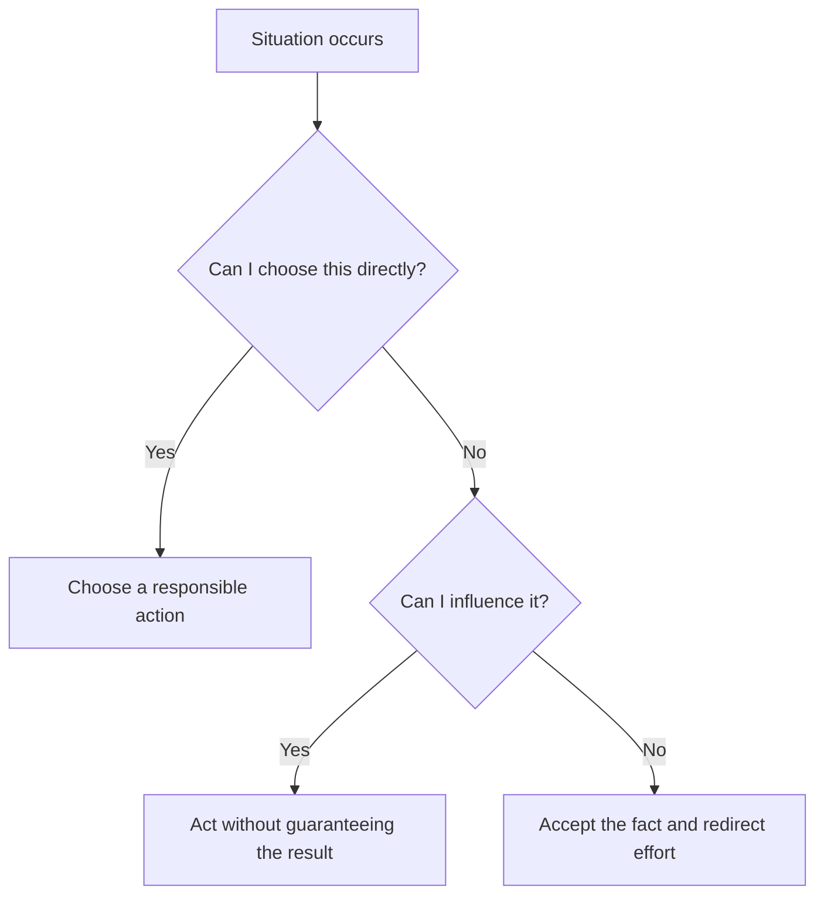
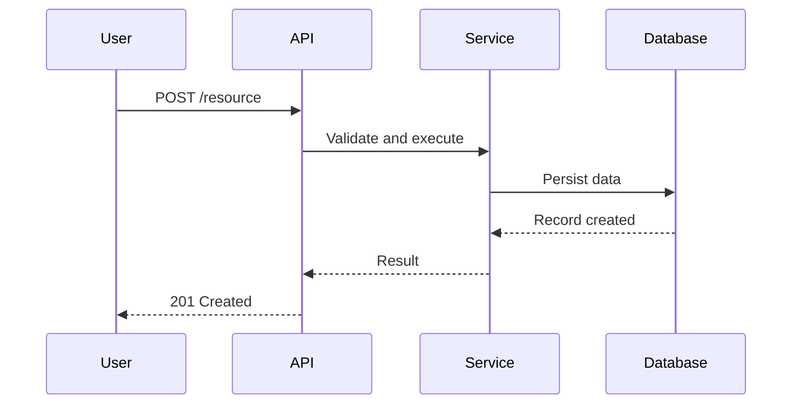
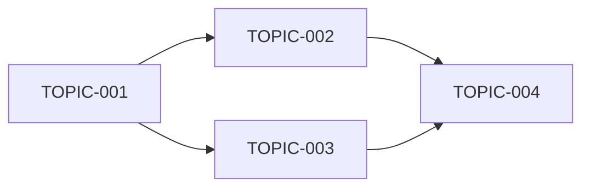

# Mermaid visual learning contract

Mermaid diagrams are first-class teaching artifacts in Open Study Path. They are used to make relationships, choices, sequences, states, dependencies and architectures visible inside GitHub-rendered Markdown.

## Required use

- Every generated roadmap must contain a Mermaid diagram of the actual topic dependency graph.
- Every materialized module must contain at least one useful Mermaid diagram unless the instance configuration raises the minimum.
- Complex modules should use multiple focused diagrams when one diagram would combine unrelated views.
- Every diagram must be introduced and followed by explanatory prose.

The diagram must teach something that would otherwise be harder to see. Decorative boxes, generic lifecycle diagrams copied into every topic and diagrams unrelated to the lesson do not satisfy the contract.

## Choosing a diagram

| Learning need | Recommended Mermaid type |
| --- | --- |
| Decision, procedure or cause-and-effect flow | `flowchart` |
| Categories and conceptual organization | `mindmap` or `flowchart` |
| Historical, project or process progression | `timeline` |
| Changes between conditions | `stateDiagram-v2` |
| Interaction between people, services or components | `sequenceDiagram` |
| Software structure and relationships | `classDiagram` |
| Data entities and relationships | `erDiagram` |
| Cloud or system architecture | `flowchart` with `subgraph`, optionally paired with `sequenceDiagram` |

Use Mermaid features that render reliably in GitHub. Avoid raw HTML, experimental syntax when a stable alternative exists, unreadably long labels and diagrams that require horizontal scrolling to understand.

## Nontechnical example: decision under uncertainty

Introduce the model before the diagram: the purpose is to separate what can be chosen directly from what can only be influenced or accepted.

After the diagram, explain the distinction, warn that influence is not control and connect the paths to the module's examples and practice.

## Technical example: service request

Explain the responsibility of each participant, where validation happens, which failures are possible and what the diagram intentionally omits.

## Roadmap example

The generated roadmap must replace placeholders with real topic IDs and dependencies.

The roadmap text should explain parallel branches, prerequisites and current materialization status.

## Review criteria

A reviewer should be able to answer yes to all of these:

1. Does the diagram represent the actual topic rather than a reusable generic picture?
2. Is the selected diagram type appropriate for the relationship being taught?
3. Does it render in GitHub Markdown?
4. Are labels concise and readable?
5. Does surrounding prose explain what to notice and what the model omits?
6. Does the lesson still contain sufficient prose, examples and practice?
7. Would an additional focused diagram improve a complex architecture, sequence or state model?

A module fails visual review when the required Mermaid block is absent, syntactically broken, decorative, unexplained or used to replace necessary teaching content.
