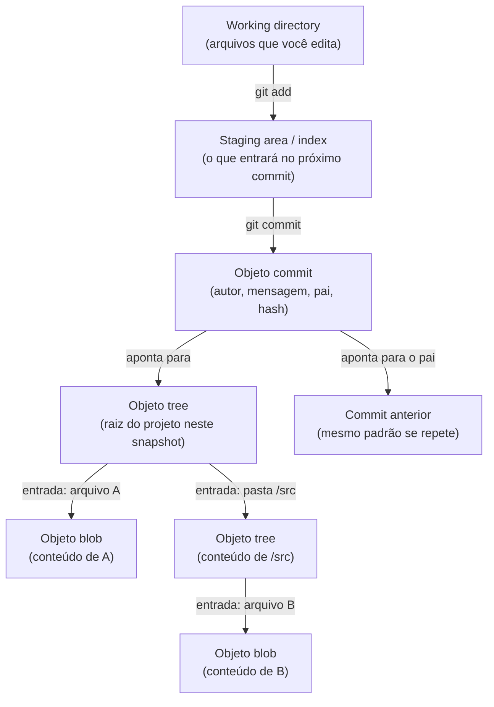

# TOPIC-001 — Modelo interno do Git: objetos, snapshots e o .git

## Antes de começar

Você já usa `git add`, `git commit`, `git push` e `git pull` sem pensar muito neles — e é exatamente por isso que esta aula existe. Ela não ensina esses comandos de novo. Ela abre o capô e mostra o que realmente acontece dentro da pasta `.git` quando você digita `git commit`. Ao final, você vai conseguir explicar, com suas próprias palavras e com evidência de terminal, o que o Git guarda de verdade — a peça que faltava para entender branches, merge, rebase e conflitos sem decorar receita.

Reserve cerca de 60 a 75 minutos, de preferência com um terminal aberto ao lado. Você vai produzir um pequeno registro de terminal com sua própria explicação de um commit que você mesmo inspecionou.

## Sua sessão de estudo

- [ ] Recuperar o que você já sabe sobre add/commit (10 min)
- [ ] Construir a intuição: por que um commit é um retrato, não uma lista de mudanças (15 min)
- [ ] Ler o conteúdo essencial sobre blobs, trees e commits (20 min)
- [ ] Refazer os exemplos trabalhados no seu próprio terminal (15 min)
- [ ] Produzir sua evidência independente e responder à autoavaliação (15 min)

## O que você vai aprender

Ao final desta aula, você vai conseguir:

- explicar o que o Git armazena internamente quando você faz um commit, usando os termos corretos (blob, tree, commit);
- inspecionar esses objetos de verdade dentro de `.git`, em vez de confiar apenas no que `git log` mostra na superfície;
- diferenciar working directory, staging area (índice) e repositório, e explicar por que `git add` existe como uma etapa separada de `git commit`.

## Começando do zero

Um **repositório** Git é, na prática, uma pasta comum acompanhada de uma pasta especial chamada `.git`, criada quando você roda `git init` (ou baixada junto quando você clona um projeto). Todo o "cérebro" do Git mora dentro dessa pasta `.git` — histórico, configuração, referências de branch, tudo.

Quando as pessoas dizem que "o Git guarda o histórico do projeto", elas costumam imaginar algo parecido com o histórico de um editor de texto: uma lista de alterações, uma depois da outra, tipo "linha 4 mudou de X para Y". É assim que sistemas mais antigos de controle de versão (como CVS ou SVN) costumavam funcionar, guardando principalmente diffs (diferenças) entre versões.

O Git faz diferente, e essa diferença é a base de tudo o que vem depois nesta trilha: cada vez que você faz um commit, o Git tira uma **fotografia completa** do estado de todos os arquivos rastreados naquele momento — não apenas o que mudou. Formalmente, essa fotografia é chamada de **snapshot**.

### Vocabulário desta aula

- **Objeto:** a unidade básica de armazenamento do Git. Todo objeto é identificado por um hash (um código único calculado a partir do seu conteúdo) e vive dentro de `.git/objects`. Existem três tipos de objeto que interessam aqui: blob, tree e commit.
- **Blob:** o objeto que guarda o conteúdo bruto de um único arquivo — sem nome de arquivo, sem pasta, só os bytes do conteúdo. "Blob" vem de *binary large object*.
- **Tree:** o objeto que representa uma pasta: uma lista de entradas, cada uma apontando para um blob (um arquivo) ou para outra tree (uma subpasta), junto com o nome de cada entrada.
- **Commit:** o objeto que representa um snapshot completo do projeto em um momento específico. Um commit aponta para uma tree (a raiz do projeto naquele momento), guarda metadados (autor, data, mensagem) e aponta para o(s) commit(s) anterior(es), chamado de *pai* (*parent*).
- **Hash SHA:** um código (por exemplo `a1b2c3d...`) calculado a partir do conteúdo de um objeto. Dois objetos com conteúdo idêntico têm exatamente o mesmo hash — é assim que o Git evita guardar a mesma informação duas vezes.
- **Staging area / index:** uma área intermediária onde você "separa" as mudanças que quer incluir no próximo commit, usando `git add`. É diferente da sua pasta de trabalho e do histórico já commitado.

## Intuição antes dos detalhes

**Analogia:** pense no Git como um álbum de fotografias em vez de um diário de bordo. Um diário registra frases como "hoje troquei a cor da parede de azul para verde" — um relato da mudança. Um álbum de fotos, por outro lado, guarda uma foto inteira da sala a cada momento importante: você vê a sala toda, não só a parede.

**Onde a analogia ajuda:** assim como uma foto mostra a sala inteira mesmo que só a parede tenha mudado, um commit do Git representa o projeto inteiro (todas as pastas e arquivos rastreados) mesmo que só um arquivo tenha sido alterado. Isso explica por que o Git consegue "voltar no tempo" para qualquer commit e ver o projeto completo daquele momento, sem precisar remontar uma sequência de diffs.

**Onde a analogia deixa de funcionar:** um álbum de fotos comum guardaria uma imagem inteiramente nova a cada foto, gastando espaço proporcional ao tamanho da sala inteira. O Git é mais esperto: se um arquivo (ou uma pasta inteira) não mudou entre dois commits, o novo snapshot **reaproveita o mesmo blob ou tree já existente**, em vez de duplicá-lo. Existe, por baixo dos panos, uma otimização de armazenamento parecida com a de sistemas de diff — mas ela é invisível para o modelo mental que você usa ao trabalhar: conceitualmente, cada commit continua sendo um snapshot completo e independente.

## Recupere o que já sabe

Antes de seguir, responda rapidamente (sem consultar nada):

1. Quando você digita `git commit`, quais dois comandos normalmente vêm antes dele no seu fluxo diário?
2. Na sua experiência, o que você imaginava que `git commit` estava "guardando" até agora?

Guarde essas respostas — você vai comparar com o que aprender nesta aula.

## Conteúdo essencial

### Da pasta de trabalho ao commit: três áreas, não duas

Muita gente pensa no Git como tendo duas áreas: "meus arquivos" e "o histórico". Na prática, existem três:

1. **Working directory (pasta de trabalho):** os arquivos que você vê e edita normalmente no seu editor de código. É o "rascunho" atual.
2. **Staging area / index:** uma área intermediária. Quando você roda `git add caminho/arquivo`, o Git copia o conteúdo atual desse arquivo para o índice — está dizendo "isto aqui é o que eu quero incluir no próximo commit".
3. **Repositório (`.git`):** o histórico permanente. Quando você roda `git commit`, o Git pega exatamente o que está no índice (não o que está na pasta de trabalho!) e cria um novo snapshot permanente a partir dele.

<!-- open-study-path:outcome LO-3 -->

Essa é a razão prática pela qual `git add` existe como etapa separada: ele permite que você monte um commit com só parte das suas mudanças, mesmo tendo editado vários arquivos. Se você mudar um arquivo depois de dar `git add` nele, o índice ainda tem a versão antiga até você rodar `git add` de novo.

### O que o commit realmente guarda

Quando você roda `git commit`, o Git cria (ou reaproveita) três tipos de objeto dentro de `.git/objects`:

- Um **blob** para cada arquivo cujo conteúdo esteja no índice. Se o conteúdo de um arquivo for idêntico ao de um commit anterior, o Git reaproveita o blob que já existe — ele não duplica.
- Uma **tree** para cada pasta, incluindo a pasta raiz do projeto. Cada tree lista suas entradas (nome + tipo + hash do blob ou da subtree correspondente).
- Um **commit**, que aponta para a tree raiz daquele snapshot, guarda autor, data, mensagem, e aponta para o commit pai (o commit anterior no histórico — ou para nenhum, no primeiro commit do repositório).

Cada um desses objetos é identificado por um **hash SHA**, calculado a partir do próprio conteúdo do objeto. É por isso que o hash de um commit muda se qualquer coisa dentro dele mudar — inclusive a mensagem ou o commit pai — mas o hash do blob de um arquivo específico permanece o mesmo enquanto o conteúdo do arquivo não mudar, mesmo em commits diferentes.

<!-- open-study-path:outcome LO-1 -->

### Inspecionando objetos de verdade

Você não precisa confiar apenas no que `git log` mostra. É possível abrir os objetos crus:

- `git log --oneline` mostra a lista de commits com hash abreviado e mensagem.
- `git cat-file -p <hash>` imprime o conteúdo de qualquer objeto (blob, tree ou commit) a partir do seu hash. Em um commit, mostra a tree raiz, o(s) pai(s), autor e mensagem. Em uma tree, mostra suas entradas. Em um blob, mostra o conteúdo bruto do arquivo.
- `git cat-file -t <hash>` mostra apenas o tipo do objeto (`blob`, `tree` ou `commit`).
- `git ls-tree <hash-ou-referência>` lista o conteúdo de uma tree de forma mais legível, mostrando nome, tipo e hash de cada entrada.

Esses comandos não fazem parte do seu fluxo diário — eles existem para você **enxergar** a estrutura que os outros comandos escondem, que é exatamente o objetivo desta aula.

<!-- open-study-path:outcome LO-2 -->

## Mapa visual

O diagrama abaixo mostra o caminho de um arquivo, desde a sua edição até virar parte permanente do histórico, e o que cada objeto aponta dentro de `.git`.

Observe três coisas neste mapa: primeiro, `git add` e `git commit` são duas transições diferentes, não uma só — é por isso que dá para escolher exatamente o que entra em cada commit. Segundo, um commit nunca aponta diretamente para um blob: ele sempre passa por uma tree, mesmo que o projeto tenha um único arquivo. Terceiro, cada commit aponta para o commit anterior (o pai), o que forma a corrente que `git log` percorre — mas essa seta de "pai" é sobre a estrutura de metadados do commit; quem reaproveita conteúdo entre snapshots são os blobs e trees que não mudaram, não os commits em si.

O que este diagrama **não mostra**: como o Git decide reaproveitar um blob já existente em vez de criar um novo (depende do hash do conteúdo ser idêntico) e como branches e `HEAD` apontam para um desses commits — isso é o assunto da próxima aula.

## Exemplos trabalhados

### Exemplo 1 — Inspecionando o primeiro commit de um repositório

**Situação:** você cria uma pasta nova, roda `git init`, cria um arquivo `leia.txt` com o texto `versão 1`, roda `git add leia.txt` e depois `git commit -m "primeira versão"`.

**Mecanismo:** ao rodar `git add`, o Git calcula o hash do conteúdo `versão 1` e cria um blob com esse hash dentro de `.git/objects`, registrando essa entrada no índice. Ao rodar `git commit`, o Git cria uma tree contendo a entrada `leia.txt → <hash do blob>`, e cria um commit apontando para essa tree, sem nenhum pai (é o primeiro commit).

**Consequência:** agora existem três objetos novos em `.git/objects`: um blob, uma tree e um commit. `git log --oneline` mostra uma linha com o hash abreviado do commit e a mensagem `primeira versão`.

**Como verificar:** rode `git cat-file -p HEAD` — você verá a linha `tree <hash>`, sem nenhuma linha `parent` (é o primeiro commit), e as linhas de autor/mensagem. Depois rode `git cat-file -p <hash-da-tree>` (o hash que apareceu na linha `tree`) — você verá uma linha listando `leia.txt` e o hash do blob correspondente. Por fim, `git cat-file -p <hash-do-blob>` deve imprimir exatamente `versão 1`.

**Limite:** este exemplo usa hashes que você só descobre depois de rodar os comandos no seu próprio terminal — os hashes são únicos por conteúdo e não podem ser previstos de antemão neste texto.

### Exemplo 2 — Por que um segundo commit não é um "diff"

**Situação:** a partir do repositório do Exemplo 1, você edita `leia.txt` para conter `versão 2` e adiciona um novo arquivo `notas.txt` com o texto `rascunho`. Você roda `git add -A` (adiciona tudo) e `git commit -m "segunda versão"`.

**Mecanismo:** o Git calcula um novo blob para o novo conteúdo de `leia.txt` (hash diferente, porque o conteúdo mudou) e um blob novo para `notas.txt`. Ele monta uma **nova tree completa** com as duas entradas (`leia.txt` apontando para o blob novo, `notas.txt` apontando para o blob de `rascunho`) e cria um novo commit, cujo pai é o commit do Exemplo 1.

**Consequência:** o segundo commit não guarda "a diferença entre versão 1 e versão 2" como um registro separado — ele guarda uma tree nova e completa, que por acaso tem uma entrada diferente da tree anterior. Rodando `git cat-file -p <hash-da-tree-nova>`, você vê as duas entradas completas, não um remendo sobre a tree antiga.

**Como verificar:** rode `git log --oneline` e veja os dois commits. Rode `git diff <hash-commit-1> <hash-commit-2>` — o Git **calcula** essa diferença na hora, comparando as duas trees completas; ele não estava guardando esse diff pronto em lugar nenhum.

**Limite/ambiguidade comum:** é tentador achar que, como `git diff` mostra uma diferença, o Git deve estar guardando diferenças. É o oposto: o Git guarda dois snapshots completos e **calcula** a diferença entre eles sob demanda, sempre que você pede. Essa é exatamente a distinção que separa o modelo do Git do modelo de sistemas mais antigos baseados em diff.

## Erros comuns e como corrigir

- **"O commit guarda só o que mudou, como um diff."** Incorreto — o commit aponta para uma tree que representa o projeto inteiro naquele momento. O que parece "só a mudança" é a exibição de `git diff` ou `git log -p`, calculada comparando dois snapshots completos, não algo armazenado como diff.
- **"Se eu editei o arquivo, já vai entrar no commit."** Incorreto — só entra no commit o que estiver no índice no momento do `git commit`. Editar o arquivo muda a working directory; é preciso `git add` para levar essa mudança até o índice.
- **"Cada arquivo tem seu próprio commit."** Incorreto — um commit é sempre um snapshot do projeto inteiro (via uma única tree raiz), mesmo que só um arquivo tenha mudado.
- **"O hash do blob muda mesmo se o conteúdo do arquivo for igual em dois commits diferentes."** Incorreto — o hash depende só do conteúdo. Um arquivo que não muda entre dois commits reaproveita exatamente o mesmo blob.

## Prática guiada

Em um repositório de teste (pode ser uma pasta vazia nova, não precisa ser um projeto real):

1. Rode `git init`, crie um arquivo com qualquer conteúdo, adicione (`git add`) e faça o primeiro commit.
   - *Dica:* se aparecer um aviso pedindo para configurar `user.name`/`user.email`, configure-os localmente antes de continuar (`git config user.name "..."` e `git config user.email "..."`).
2. Rode `git cat-file -p HEAD` e identifique a linha `tree`.
   - *Dica:* o hash depois de `tree` é o que você vai usar no próximo passo.
3. Rode `git cat-file -p <hash-da-tree>` e identifique a entrada do seu arquivo.
   - *Dica:* compare o hash do blob mostrado aqui com o que aparece se você rodar `git ls-tree HEAD` — devem ser o mesmo hash, em formatos ligeiramente diferentes.
4. Edite o arquivo, adicione de novo, faça um segundo commit, e rode `git cat-file -p HEAD` de novo.
   - *Dica:* compare a linha `parent` deste segundo commit com o hash do primeiro commit — devem ser o mesmo valor.

Não avance para a prática independente até conseguir apontar, no seu próprio terminal, onde está o blob, a tree e o commit do seu primeiro snapshot.

## Prática independente

Crie (ou reaproveite) um repositório de teste com pelo menos três commits, onde:

- o segundo commit modifica um arquivo já existente;
- o terceiro commit adiciona um arquivo novo **sem** modificar o arquivo do commit anterior.

Depois, produza uma explicação escrita (4 a 8 frases) respondendo: "no terceiro commit, qual blob foi reaproveitado do commit anterior, e qual foi criado novo? Como você comprovou isso usando `git cat-file` ou `git ls-tree`?" Essa explicação, junto com a saída dos comandos que você usou para comprovar, é a evidência desta etapa.

## Outras formas de aprender

- **Interativo — Learn Git Branching:** uma visualização interativa gratuita do grafo de commits do Git (learngitbranching.js.org). Útil para ver commits e seus pais se conectando visualmente, complementando a inspeção via terminal que você fez nesta aula. Não exige conta; funciona no navegador.
- **Leitura oficial aprofundada:** o capítulo "Git Internals" do Pro Git (link na tabela de fontes abaixo) detalha exatamente os mesmos objetos desta aula com mais profundidade técnica, incluindo compressão e packfiles — vá além apenas se quiser detalhes de implementação.

## Confira sem consultar

Sem olhar o restante da aula, responda:

1. Com suas próprias palavras: por que um commit é chamado de "snapshot" e não de "diff"? Cite o que acontece com blobs e trees para justificar.
2. Você tem um repositório com dois commits. Só o arquivo `a.txt` mudou entre eles. O blob de `b.txt` (que não mudou) é duplicado no segundo commit, ou reaproveitado? Explique por quê, usando o conceito de hash de conteúdo.

Se errar qualquer uma, volte apenas ao trecho relacionado ("O que o commit realmente guarda" ou o Exemplo 2) e tente responder de novo sem consultar.

## O que você vai produzir

O entregável desta etapa é a explicação escrita da "Prática independente" (o parágrafo sobre o terceiro commit) acompanhada da saída de terminal que comprova sua resposta (pode ser colada como texto ou um link para um gist/arquivo). Cole os dois no campo de evidência do formulário de avaliação. Não é necessário nenhum dado pessoal além disso.

## Avaliação

Abra a avaliação direto por aqui: https://github.com/diegomoura/open-study-path-agent-test-20260831211026/issues/new?template=assessment-topic-001.yml

Depois de enviar suas respostas, volte ao chat e escreva:

`Terminei Modelo interno do Git: objetos, snapshots e o .git. Avalie minhas respostas.`

## Como este conteúdo foi construído

A explicação de blobs, trees e commits como objetos de conteúdo endereçável, e a distinção entre working directory, staging area e repositório, seguem diretamente o capítulo "Git Internals" do Pro Git e a documentação oficial de `git-cat-file` e `git-ls-tree`, ambos consultados para esta aula. A analogia do álbum de fotos versus diário de bordo é uma adaptação pedagógica criada especificamente para esta trilha — não aparece nas fontes originais — assim como os dois exemplos passo a passo e o diagrama Mermaid, construídos para o seu nível declarado de iniciante em internals do Git com prática diária de add/commit/push/pull.

## Fontes e caminhos para aprofundar

| Tipo | Fonte | Como foi usada nesta aula | Acesso |
| --- | --- | --- | --- |
| Primária / oficial | Chacon, S.; Straub, B. *Pro Git*, capítulo 10 "Git Internals — Plumbing and Porcelain" — https://git-scm.com/book/en/v2/Git-Internals-Plumbing-and-Porcelain | Base da explicação de objetos (blob/tree/commit), hash de conteúdo e estrutura de `.git/objects` | público, gratuito |
| Referência técnica oficial | Documentação oficial `git-cat-file` — https://git-scm.com/docs/git-cat-file e `git-ls-tree` — https://git-scm.com/docs/git-ls-tree | Base dos comandos de inspeção usados na prática guiada e independente | público, gratuito |
| Explicação confiável | GitHub Docs, "About Git" — https://docs.github.com/en/get-started/using-git/about-git | Conferência da explicação introdutória de como o Git rastreia mudanças, em nível iniciante | público, gratuito |
| Complementar / interativo | Learn Git Branching — https://learngitbranching.js.org/ | Visualização interativa do grafo de commits, sugerida como prática opcional adicional | público, gratuito |
