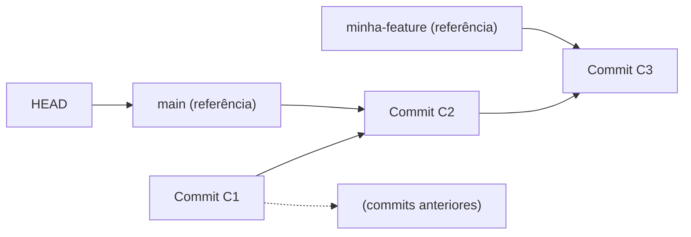

# TOPIC-002 — Branches e HEAD como ponteiros

## Antes de começar

Na Aula 01 você viu o que um commit realmente guarda. Agora você vai entender o que uma **branch** é de verdade — e por que ela não tem nada a ver com "copiar a pasta do projeto". Você também vai entender o que é `HEAD`, o marcador que diz "onde você está agora" dentro do histórico. Ao final, você vai conseguir prever, antes de rodar o comando, o que vai acontecer com os ponteiros ao criar, trocar ou apagar uma branch — e comprovar sua previsão inspecionando o repositório.

Reserve cerca de 45 a 60 minutos. Você vai produzir uma previsão escrita e a saída de terminal que confirma ou corrige essa previsão.

## Sua sessão de estudo

- [ ] Recuperar o que já sabe: revisar rapidamente o que é um commit (10 min)
- [ ] Estudar branch e HEAD como referências, não cópias (15 min)
- [ ] Inspecionar `.git/refs` e `git log --oneline --graph` no seu terminal (15 min)
- [ ] Prever e testar o efeito de criar/trocar/apagar uma branch (14 min)

## O que você vai aprender

Ao final desta aula, você vai conseguir:

- descrever tecnicamente o que é uma branch (uma referência leve que aponta para um commit) e o que é `HEAD`;
- prever o efeito de criar, trocar e apagar branches sobre os ponteiros e o histórico, incluindo fast-forward e detached HEAD;
- inspecionar para onde branches e `HEAD` apontam usando `git log --oneline --graph` e os arquivos em `.git/refs`.

## Começando do zero

Na Aula 01 você viu que um commit é um objeto identificado por um hash — algo como `a1b2c3d`. Só que ninguém digita hashes o dia inteiro para navegar entre versões do projeto. É aqui que entram as **branches**: um jeito de dar um nome fácil de lembrar para "o commit mais recente de uma linha de trabalho", em vez de decorar hashes.

Uma confusão comum, inclusive para quem já usa Git há um tempo, é imaginar que criar uma branch "duplica" o projeto — como se você estivesse copiando todos os arquivos para uma pasta paralela. Não é isso que acontece. Criar uma branch é uma operação praticamente instantânea e barata, porque uma branch não copia nada: ela só **aponta** para um commit que já existe.

### Vocabulário desta aula

- **Referência (ref):** um nome legível por humanos que o Git guarda apontando para um hash de commit. Branches e tags são os tipos de referência mais comuns.
- **HEAD:** a referência especial que indica onde você está agora no histórico. Na maior parte do tempo, `HEAD` aponta para uma branch (por exemplo, `main`), e essa branch aponta para um commit. Ou seja, normalmente `HEAD` aponta para uma branch, que aponta para um commit — é uma referência para outra referência.
- **Fast-forward:** o caso em que mover uma branch para a frente é só "andar o ponteiro" ao longo de commits que já existem em sequência, sem precisar criar nenhum commit novo.
- **Detached HEAD:** o estado em que `HEAD` aponta diretamente para um commit específico (por hash), em vez de apontar para uma branch. Acontece, por exemplo, quando você faz `git checkout <hash-de-commit>` diretamente.

## Intuição antes dos detalhes

**Analogia:** pense em cada branch como uma etiqueta adesiva colada na lombada de um livro de uma estante (o histórico de commits), marcando "aqui é o capítulo mais recente da história X". `HEAD` é um pequeno post-it que diz "você está lendo aqui agora" — normalmente colado do lado de uma dessas etiquetas.

**Onde a analogia ajuda:** mover uma etiqueta adesiva para uma página diferente não reescreve o livro nem copia páginas — ela só passa a apontar para outro lugar. É exatamente assim que criar, mover ou trocar de branch funciona: o Git só reposiciona um ponteiro pequeno, nunca duplica o conteúdo do projeto inteiro.

**Onde a analogia deixa de funcionar:** um post-it físico só pode estar colado do lado de uma etiqueta existente. O `HEAD` do Git, porém, pode se descolar de qualquer etiqueta e apontar direto para uma página (um commit) sem etiqueta nenhuma por perto — esse é o estado chamado *detached HEAD*. Nesse estado, se você criar um novo commit, ele existe, mas nenhuma branch aponta para ele; é fácil "perdê-lo de vista" se você trocar de branch sem primeiro criar uma branch nova para guardá-lo.

## Recupere o que já sabe

Antes de seguir, sem consultar nada:

1. O que é um commit, e como ele é identificado (revisão da Aula 01)?
2. Na sua experiência, o que você imaginava que acontecia "por baixo dos panos" ao rodar `git checkout -b nome-da-branch`?

## Conteúdo essencial

### Uma branch é uma referência, não uma cópia

Tecnicamente, uma branch em Git é um arquivo pequeno (ou uma entrada em uma estrutura compactada de referências) que guarda apenas um hash de commit. Quando você roda `git branch minha-feature`, o Git cria uma nova referência chamada `minha-feature` apontando para o mesmo commit em que `HEAD` está agora — nada mais é copiado.

<!-- open-study-path:outcome LO-1 -->

`HEAD`, por sua vez, é uma referência especial que aponta normalmente para uma branch (o caso comum) ou, no estado *detached*, diretamente para um commit. Quando você faz um novo commit estando numa branch, o Git: (1) cria o novo objeto commit, apontando para o commit atual como pai; (2) atualiza a branch para apontar para esse novo commit; (3) `HEAD` continua apontando para a mesma branch — só a branch se moveu.

### O que muda ao criar, trocar e apagar uma branch

- **Criar uma branch** (`git branch nome` ou `git switch -c nome`) cria uma nova referência apontando para o commit atual. `HEAD` não muda de lugar sozinho com `git branch` puro — só com `git switch -c` ou `git checkout -b`, que criam e já trocam para a nova branch.
- **Trocar de branch** (`git switch nome` ou `git checkout nome`) move `HEAD` para apontar para essa outra branch, e o Git atualiza os arquivos da working directory para bater com o commit para o qual essa branch aponta.
- **Apagar uma branch** (`git branch -d nome`) remove apenas a referência — os commits que só estavam alcançáveis por ela deixam de ter um "nome fácil" para acessá-los, mas não são apagados imediatamente do banco de objetos (eles só se tornam candidatos à limpeza posterior se nenhuma outra referência os alcançar).
- **Fast-forward:** se a branch de destino não teve nenhum commit novo desde que sua branch atual se separou dela, atualizar (por exemplo, via merge) é só mover o ponteiro para a frente — não é criado nenhum commit novo de integração. Você vai ver esse conceito de novo, com mais peso, na Aula 03 (merge).

<!-- open-study-path:outcome LO-2 -->

### Inspecionando branches e HEAD de verdade

Você pode ver essas referências diretamente:

- `cat .git/HEAD` mostra para onde `HEAD` aponta agora — normalmente algo como `ref: refs/heads/main`, ou seja, "HEAD aponta para a branch main".
- `ls .git/refs/heads/` lista as branches locais como arquivos; cada arquivo contém o hash do commit para onde aquela branch aponta.
- `git log --oneline --graph --all` desenha visualmente onde cada branch está e como o histórico se ramifica, sem precisar abrir arquivos manualmente.
- `git branch -v` lista as branches locais junto com o hash abreviado do commit para o qual cada uma aponta.

<!-- open-study-path:outcome LO-3 -->

## Mapa visual

Neste mapa, `main` e `minha-feature` compartilham todo o histórico até `C2`: `minha-feature` foi criada a partir de `main` e depois recebeu um commit próprio (`C3`), enquanto `main` ainda está em `C2`. Note que `HEAD` aponta para `main` neste momento — se você rodasse `git switch minha-feature`, a seta de `HEAD` se moveria para apontar para `minha-feature` em vez de `main`, e os arquivos da working directory passariam a refletir o commit `C3`. O que este diagrama não mostra é *como* `C3` foi criado a partir de `C2` (isso é conteúdo normal de commit, igual ao da Aula 01) nem o que acontece quando duas branches divergem e depois precisam ser reunidas — isso é assunto das Aulas 03 e 04.

## Exemplos trabalhados

### Exemplo 1 — Criando uma branch e observando o ponteiro se mover

**Situação:** você está no commit `C2` da branch `main`. Você roda `git switch -c minha-feature` e depois faz um commit novo.

**Mecanismo:** `git switch -c` cria a referência `minha-feature` apontando para `C2` (o commit atual) e move `HEAD` para apontar para `minha-feature`. Ao fazer o commit novo, o Git cria `C3` com `C2` como pai, e move a referência `minha-feature` (não `main`) para apontar para `C3`, porque é ela que `HEAD` está seguindo agora.

**Consequência:** `main` continua exatamente em `C2`; só `minha-feature` avançou. Se você voltar para `main` (`git switch main`), a working directory volta a refletir o conteúdo de `C2`, e o commit `C3` "some de vista" — mas continua existindo, alcançável através de `minha-feature`.

**Como verificar:** rode `git log --oneline --graph --all` antes e depois de trocar de branch. Compare com `cat .git/refs/heads/main` e `cat .git/refs/heads/minha-feature` — os hashes devem bater com o que o gráfico mostrou.

**Limite:** este exemplo assume que você não tem mudanças não commitadas ao trocar de branch. Trocar de branch com mudanças pendentes que conflitam com o commit de destino pode ser bloqueado pelo Git — esse cenário mais avançado não é o foco desta aula.

### Exemplo 2 — Detached HEAD ao dar checkout direto em um commit

**Situação:** você roda `git checkout <hash-de-C1>` diretamente (usando o hash, não um nome de branch).

**Mecanismo:** o Git move `HEAD` para apontar diretamente para o commit `C1`, em vez de apontar para uma branch. Nenhuma referência de branch é criada ou movida. O Git normalmente avisa isso no terminal com uma mensagem sobre "detached HEAD".

**Consequência:** se, nesse estado, você criar um novo commit `C1b`, ele é criado normalmente (com `C1` como pai) — mas nenhuma branch aponta para ele. Se você trocar de volta para `main` sem criar uma branch para `C1b` antes, esse commit fica sem nenhum nome apontando para ele.

**Como verificar:** rode `git branch --show-current` — em estado detached, esse comando não mostra nome nenhum (porque `HEAD` não está numa branch). Para não perder `C1b`, rode `git switch -c salvar-experimento` **antes** de trocar de volta para `main`; isso cria uma branch nova apontando para `C1b`.

**Ambiguidade/erro comum:** um commit criado em detached HEAD não é apagado na hora — mas fica "invisível" para navegação normal por nome até que alguma branch passe a apontar para ele. É por isso que times costumam evitar trabalhar por muito tempo em detached HEAD sem criar uma branch logo em seguida.

## Erros comuns e como corrigir

- **"Criar uma branch copia os arquivos do projeto."** Incorreto — criar uma branch cria só uma referência (um ponteiro) para um commit que já existe; nenhum arquivo é duplicado.
- **"Apagar uma branch apaga os commits dela."** Incorreto — apagar uma branch remove a referência. Os commits só deixam de ter um "nome" fácil para acessá-los; eles continuam no banco de objetos até uma limpeza posterior, e continuam acessíveis se outra referência (como outra branch) ainda os alcançar.
- **"HEAD é o mesmo que a branch main."** Incorreto — `HEAD` é o marcador de "onde você está agora"; ele pode apontar para `main`, para qualquer outra branch, ou diretamente para um commit (detached HEAD).
- **"Trocar de branch é uma operação pesada, tipo abrir outro projeto."** Incorreto — trocar de branch é rápido: o Git só atualiza para onde `HEAD` aponta e ajusta os arquivos da working directory para bater com o commit de destino.

## Prática guiada

No mesmo repositório de teste da Aula 01 (ou em um novo, com pelo menos dois commits):

1. Rode `cat .git/HEAD` e `ls .git/refs/heads/`. Anote para onde `HEAD` aponta agora.
   - *Dica:* o conteúdo de `.git/HEAD` deve começar com `ref: refs/heads/`.
2. Crie uma branch nova com `git switch -c experimento` e rode `git log --oneline --graph --all`.
   - *Dica:* neste momento, `experimento` e sua branch original devem apontar para o mesmo commit.
3. Faça um commit novo estando em `experimento`, depois rode `git log --oneline --graph --all` de novo.
   - *Dica:* observe qual referência se moveu e qual ficou parada.
4. Troque de volta para a branch original e confirme, olhando os arquivos, que o commit novo "sumiu" da working directory (mas não do repositório).
   - *Dica:* rode `git log --oneline --graph --all` mais uma vez para provar que o commit continua existindo, só não está na branch atual.

Não avance até conseguir apontar, no seu terminal, exatamente qual arquivo dentro de `.git/refs/heads/` mudou em cada passo.

## Prática independente

Escreva, **antes de rodar qualquer comando**, uma previsão de 3 a 5 frases respondendo: "se eu criar uma branch nova a partir daqui, fizer um commit nela, depois voltar para a branch original e apagar a branch nova, o que acontece com o commit que criei — ele desaparece imediatamente ou não?" Depois, execute o cenário de verdade, capture a saída relevante (`git log --oneline --graph --all` antes e depois de apagar a branch) e escreva se sua previsão estava certa, incompleta ou errada, e por quê.

## Outras formas de aprender

- **Interativo — Learn Git Branching:** o mesmo ambiente interativo da Aula 01, mas agora focado nos exercícios iniciais de criar e trocar branches (learngitbranching.js.org) — ótimo para ver graficamente o ponteiro se movendo, sem risco de bagunçar um repositório real.
- **Leitura oficial aprofundada:** o capítulo "Git Internals — Git References" do Pro Git (link na tabela abaixo) mostra o formato exato dos arquivos dentro de `.git/refs` e como o Git otimiza referências com packed-refs — vá além apenas se quiser ver o formato de arquivo bruto.

## Confira sem consultar

Sem olhar o restante da aula, responda:

1. Com suas próprias palavras: por que dizemos que uma branch é "leve"? O que exatamente existe quando você cria uma branch nova?
2. Se você apagar uma branch cujo commit mais recente não existe em nenhuma outra branch, o que acontece com esse commit imediatamente? E se ele também existir em outra branch?

Se errar qualquer uma, volte apenas ao trecho relacionado ("Uma branch é uma referência, não uma cópia" ou "O que muda ao criar, trocar e apagar uma branch") e tente responder de novo sem consultar.

## O que você vai produzir

O entregável é a previsão escrita da "Prática independente", seguida da saída de terminal (`git log --oneline --graph --all` antes/depois) e da sua avaliação de acerto ou erro da previsão. Cole tudo no campo de evidência do formulário de avaliação.

## Avaliação

Abra a avaliação direto por aqui: https://github.com/diegomoura/open-study-path-agent-test-20260831211026/issues/new?template=assessment-topic-002.yml

Depois de enviar suas respostas, volte ao chat e escreva:

`Terminei Branches e HEAD como ponteiros. Avalie minhas respostas.`

## Como este conteúdo foi construído

A definição de branch como referência leve e de `HEAD` como referência para a referência atual segue o capítulo "Git Internals — Git References" do Pro Git e a documentação oficial de `git-switch`, ambos consultados para esta aula. A analogia das etiquetas adesivas e do post-it, os dois exemplos passo a passo e o diagrama Mermaid são adaptações pedagógicas criadas especificamente para esta trilha, considerando que você já tinha uma intuição correta sobre "branch como ponteiro" antes desta aula, mas ainda não a mecânica formal de HEAD e refs.

## Fontes e caminhos para aprofundar

| Tipo | Fonte | Como foi usada nesta aula | Acesso |
| --- | --- | --- | --- |
| Primária / oficial | Chacon, S.; Straub, B. *Pro Git*, capítulo 10.3 "Git Internals — Git References" — https://git-scm.com/book/en/v2/Git-Internals-Git-References | Base da explicação de branch e HEAD como referências, e do formato de `.git/refs` | público, gratuito |
| Referência técnica oficial | Documentação oficial `git-switch` — https://git-scm.com/docs/git-switch | Base dos comandos usados para criar e trocar de branch na prática guiada | público, gratuito |
| Explicação confiável | GitHub Docs, "About branches" — https://docs.github.com/en/repositories/configuring-branches-and-merges-in-your-repository/managing-branches-in-your-repository/about-branches | Conferência da explicação introdutória de branches no contexto de um repositório GitHub | público, gratuito |
| Complementar / interativo | Learn Git Branching — https://learngitbranching.js.org/ | Visualização interativa de branches e HEAD se movendo, sugerida como prática opcional adicional | público, gratuito |
