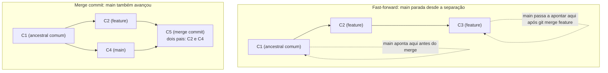

# TOPIC-003 — Merge: unindo histórias de trabalho

## Antes de começar

Você já sabe que uma branch é uma referência que aponta para um commit, e que `HEAD` marca onde você está agora (Aula 02). Esta aula usa essa base para responder a uma pergunta muito prática: quando você roda `git merge`, o que o Git realmente faz para juntar duas linhas de trabalho em uma só? Você vai aprender a diferença entre um merge que só "anda o ponteiro para frente" (fast-forward) e um merge que precisa criar um novo commit para representar a junção (merge commit) — e por que o Git escolhe um ou outro sem você pedir.

Reserve cerca de 60 a 75 minutos, com um terminal aberto. Ao final, você vai ter criado os dois tipos de merge com suas próprias mãos e vai saber ler o histórico resultante (`git log --graph`) para explicar por que ele tem aquele formato.

## Sua sessão de estudo

- [ ] Recuperar o que já sabe sobre branches e fast-forward (10 min)
- [ ] Estudar merge commit, fast-forward merge e ancestral comum (20 min)
- [ ] Praticar um merge fast-forward e um merge com commit de merge no seu terminal (25 min)
- [ ] Ler o histórico resultante com `git log --graph` e explicar o porquê (15 min)

## O que você vai aprender

Ao final desta aula, você vai conseguir:

- executar um merge e prever, antes de rodar o comando, se ele vai ser fast-forward ou vai criar um commit de merge;
- explicar o papel do **ancestral comum** (merge base) na decisão do Git;
- ler a saída de `git log --graph` de um merge e descrever, com suas palavras, o que aconteceu.

<!-- open-study-path:outcome LO-1 -->

## Começando do zero

Quando duas pessoas (ou você, em duas branches diferentes) fazem commits que partem do mesmo ponto do histórico, o projeto passa a ter duas "versões futuras" possíveis. **Merge** é a operação que reúne essas duas linhas de volta em uma só: você fica em uma branch (normalmente a que vai "receber" as mudanças) e roda `git merge nome-da-outra-branch`.

O que acontece depois disso depende inteiramente de uma pergunta: **a branch em que você está avançou desde que as duas se separaram, ou ela ficou parada?**

### Vocabulário desta aula

- **Merge:** a operação de unir o histórico de duas branches em uma só linha de trabalho.
- **Ancestral comum (merge base):** o commit mais recente que as duas branches têm em comum — o ponto exato onde elas "se separaram" pela última vez. O Git encontra esse commit automaticamente para decidir como fazer o merge.
- **Fast-forward merge:** quando a branch em que você está não teve nenhum commit novo desde a separação, o Git não precisa "juntar" nada de verdade — ele só move o ponteiro da branch para frente, até o último commit da outra branch. Nenhum commit novo é criado.
- **Merge commit:** quando as duas branches divergiram de verdade (ambas têm commits novos desde a separação), o Git precisa criar um novo commit especial, que tem **dois pais** (aponta para os dois últimos commits das duas branches), para representar a junção.

## Intuição antes dos detalhes

**Analogia:** pense em duas pessoas que saem juntas de um mesmo cruzamento (o ancestral comum) e seguem por ruas diferentes. Se uma delas nunca andou (ficou parada exatamente no cruzamento), a outra simplesmente "puxa" essa pessoa parada até onde ela está — não precisa negociar nada, porque não existe conflito de caminho: é um fast-forward. Mas se as duas efetivamente andaram por ruas diferentes, juntar as duas jornadas em um só relato exige um "ponto de encontro" novo, que reconhece as duas trajetórias — isso é o merge commit, com dois pais.

**Onde a analogia ajuda:** ela mostra por que o Git só cria um commit de merge quando existe divergência real dos dois lados. Se um dos lados está simplesmente "atrasado" (nenhum commit próprio desde a separação), não existem duas jornadas para reconciliar — só uma jornada que precisa ser reconhecida pelo outro lado.

**Onde a analogia deixa de funcionar:** ruas não têm conteúdo que possa "colidir" fisicamente ao se juntar. No merge de verdade, se as duas branches mudaram trechos diferentes de arquivos diferentes (ou até do mesmo arquivo, em partes diferentes), o Git consegue combinar automaticamente. Só quando as duas mudam exatamente a mesma parte do mesmo arquivo é que aparece um **conflito** — e conflitos são o assunto da Aula 05, não desta aula. Aqui você pratica cenários sem conflito, para focar primeiro em entender fast-forward vs. merge commit.

## Recupere o que já sabe

Antes de continuar, responda rapidamente (sem consultar nada):

1. O que é uma branch, em termos do que ela aponta? (Aula 02)
2. Se você criar uma branch nova e não fizer nenhum commit nela, para onde ela aponta em relação à branch original?

Guarde essas respostas — elas são exatamente o que explica por que fast-forward funciona.

## Conteúdo essencial

### Fast-forward: quando não há nada para reconciliar

Imagine que você está na branch `main`, cria uma branch `feature`, faz dois commits em `feature` e **não faz nenhum commit novo em `main`** nesse meio tempo. Quando você volta para `main` e roda `git merge feature`, o Git percebe que `main` não tem nenhum commit que `feature` não tenha — ou seja, o ancestral comum entre as duas é o próprio commit onde `main` está parada. Não existe nada para "juntar": o Git simplesmente move o ponteiro de `main` para frente, até o último commit de `feature`. Esse é o **fast-forward merge**. Nenhum commit novo é criado; o histórico continua sendo uma linha reta.

### Merge commit: quando as duas branches divergiram

Agora imagine que, depois de criar `feature` e fazer commits nela, você também faz um commit novo em `main` (por exemplo, uma correção direto na branch principal). Agora `main` e `feature` **divergiram**: cada uma tem pelo menos um commit que a outra não tem. Quando você roda `git merge feature` estando em `main`, o Git não pode simplesmente mover o ponteiro — precisa combinar as mudanças de ambos os lados. Ele faz isso criando um **merge commit**: um commit novo, com uma tree que reflete a combinação das mudanças, e que aponta para **dois pais** — o último commit de `main` e o último commit de `feature`.

<!-- open-study-path:outcome LO-1 -->

### O papel do ancestral comum

Em ambos os casos, o Git primeiro precisa encontrar o **ancestral comum** (merge base): o commit mais recente compartilhado pelas duas branches. Ele usa esse ponto como referência de comparação — é a partir dele que o Git calcula "o que mudou de um lado" e "o que mudou do outro lado" para decidir se dá para fazer fast-forward (nada mudou de um lado) ou se precisa de um merge commit (mudou dos dois lados).

Isso explica por que a mesma sequência de comandos (`git merge feature`) pode ter dois comportamentos completamente diferentes: o resultado depende inteiramente de onde está o ancestral comum e do que aconteceu depois dele em cada branch — não do comando em si.

### Lendo o histórico com `git log --graph`

Depois de um merge, `git log --oneline --graph --all` mostra visualmente o formato do histórico:

- Um fast-forward aparece como uma **linha reta**: os commits da branch mesclada simplesmente passam a fazer parte da linha principal, sem nenhuma bifurcação visível.
- Um merge commit aparece como duas linhas que se **separam e depois se juntam** em um ponto (o merge commit), que o gráfico geralmente desenha com um `|\` seguido de um `|/` — as duas ramificações visuais convergindo em um só commit.

<!-- open-study-path:outcome LO-2 -->

## Mapa visual

O diagrama abaixo mostra os dois cenários lado a lado: à esquerda, um fast-forward (branch principal parada); à direita, um merge commit (as duas branches avançaram).

Observe três coisas: primeiro, nos dois cenários existe o mesmo tipo de ancestral comum (C1) — a diferença é só o que aconteceu depois dele em cada branch. Segundo, no fast-forward não existe nenhum commit novo: `main` só passa a apontar para C3. Terceiro, no merge commit, C5 é um commit genuinamente novo com dois pais — é esse commit que `git log --graph` desenha como o ponto onde duas linhas se encontram. O que este diagrama **não mostra**: o que acontece quando as duas branches mudam a mesma linha do mesmo arquivo (isso gera um conflito, coberto na Aula 05, não aqui).

## Exemplos trabalhados

### Exemplo 1 — Fast-forward passo a passo

**Situação:** você está em `main` no commit C1. Roda `git switch -c feature`, faz dois commits (C2 e C3) só na branch `feature`. Não faz nada em `main` nesse meio tempo. Depois roda `git switch main` e `git merge feature`.

**Mecanismo:** o Git verifica o ancestral comum entre `main` e `feature` — que é C1, exatamente onde `main` está parada. Como `main` não tem nenhum commit próprio depois de C1, não há nada para reconciliar: o Git apenas atualiza o ponteiro de `main` para C3.

**Consequência:** nenhum commit novo aparece no histórico. `git log --oneline` mostra C1, C2, C3 em uma linha reta, e tanto `main` quanto `feature` agora apontam para C3.

**Como verificar:** rode `git log --oneline --graph --all` antes e depois do merge. Antes, você verá `main` apontando para C1 e `feature` apontando para C3 num ramo separado. Depois do merge, ambos os rótulos aparecem juntos, apontando para C3, numa única linha.

**Limite:** este exemplo só funciona porque `main` ficou parada. Se alguém tivesse feito qualquer commit em `main` depois de C1, o fast-forward deixaria de ser possível — é exatamente o Exemplo 2.

### Exemplo 2 — Merge commit passo a passo

**Situação:** a partir do mesmo ponto C1, você cria `feature` e faz um commit C2 nela. Só que, antes de fazer o merge, você também faz um commit C4 diretamente em `main` (por exemplo, uma correção de digitação em um arquivo que `feature` não toca). Agora você roda `git switch main` e `git merge feature`.

**Mecanismo:** o Git calcula o ancestral comum (ainda C1), mas agora percebe que `main` tem C4 (que `feature` não tem) e `feature` tem C2 (que `main` não tem) — as duas divergiram. Como nenhuma delas é "descendente direta" da outra, o Git combina as duas trees (a de C4 e a de C2) e cria um novo commit C5, com dois pais: C4 e C2.

**Consequência:** o histórico deixa de ser uma linha reta. `git log --oneline --graph` mostra C1 se ramificando em C2 e C4, que depois se juntam em C5.

**Como verificar:** rode `git cat-file -p HEAD` logo depois do merge — você verá **duas linhas `parent`**, uma apontando para C4 e outra para C2. É essa dupla paternidade que diferencia um merge commit de um commit normal.

**Limite/ambiguidade comum:** se C4 e C2 tivessem alterado exatamente a mesma linha do mesmo arquivo, o Git não conseguiria combinar as duas trees automaticamente — isso gera um **conflito de merge**, que exige resolução manual. Este exemplo assume que as mudanças não colidem; conflitos reais são o assunto da Aula 05.

## Erros comuns e como corrigir

- **"Todo merge cria um commit de merge."** Incorreto — quando a branch de destino não avançou desde a separação, o Git faz fast-forward e não cria nenhum commit novo. Um merge commit só aparece quando as duas branches realmente divergiram.
- **"O merge junta arquivos linha a linha, sem se importar com o histórico."** Incorreto — o Git primeiro encontra o ancestral comum e usa esse ponto de referência para saber o que mudou de cada lado. A combinação de conteúdo (incluindo o que vira conflito) depende desse ponto de partida, não apenas do conteúdo final dos arquivos.
- **"Fast-forward também cria um commit, só que 'escondido'."** Incorreto — em um fast-forward puro, nenhum objeto commit novo é criado. O ponteiro da branch simplesmente passa a apontar para um commit que já existia.
- **"Um merge commit só tem um pai, como qualquer outro commit."** Incorreto — um merge commit tem, no mínimo, dois pais. É exatamente essa dupla paternidade que `git log --graph` desenha como duas linhas se encontrando.

## Prática guiada

Em um repositório de teste novo:

1. Crie um commit inicial C1 na `main`. Rode `git switch -c feature` e faça dois commits nela.
   - *Dica:* use `git switch main` e depois `git switch feature` para alternar, revisando o que aprendeu na Aula 02.
2. Sem tocar em `main`, volte para ela (`git switch main`) e rode `git merge feature`.
   - *Dica:* observe a mensagem que o próprio Git imprime — ela costuma dizer explicitamente "Fast-forward".
3. Rode `git log --oneline --graph --all` e confirme que o histórico é uma linha reta.
4. Comece de novo em um repositório novo: crie C1, crie `feature` com um commit C2, volte para `main` e faça um commit C4 diferente. Rode `git merge feature`.
   - *Dica:* se o editor de mensagem de commit abrir automaticamente, é porque o Git precisa de uma mensagem para o merge commit — isso já é uma pista de que não foi fast-forward.
5. Rode `git cat-file -p HEAD` e conte quantas linhas `parent` aparecem.

Não avance para a prática independente até conseguir prever, antes de rodar `git merge`, se cada cenário vai ser fast-forward ou vai gerar um merge commit.

## Prática independente

Crie os dois cenários (fast-forward e merge commit) em um repositório de teste, exatamente como na prática guiada, mas com pelo menos três commits em cada branch antes do merge (em vez de dois). Para cada cenário, produza:

- a saída de `git log --oneline --graph --all` antes e depois do merge;
- uma explicação escrita de por que aquele cenário resultou em fast-forward ou em merge commit, citando explicitamente onde está o ancestral comum.

Essa explicação, junto com as duas saídas de terminal, é a evidência desta etapa.

## Outras formas de aprender

- **Interativo — Learn Git Branching:** os níveis iniciais de "Introduction Sequence" em learngitbranching.js.org praticam exatamente fast-forward vs. merge commit com feedback visual imediato. Útil como complemento depois de já ter feito os dois cenários no seu próprio terminal. Gratuito, funciona no navegador.
- **Leitura oficial:** a documentação de `git-merge` detalha as estratégias de merge além do fast-forward (como `recursive` e `ort`), caso você queira entender o que acontece por trás da combinação automática de conteúdo — vá além apenas se quiser detalhes de implementação.

## Confira sem consultar

Sem olhar o restante da aula, responda:

1. Com suas próprias palavras: o que precisa ser verdade sobre a branch de destino para que um merge seja fast-forward?
2. Um merge commit tem quantos pais, no mínimo? O que `git log --graph` desenha para representar isso visualmente?

Se errar qualquer uma, volte apenas ao trecho relacionado ("Fast-forward: quando não há nada para reconciliar" ou "Merge commit: quando as duas branches divergiram") e tente responder de novo sem consultar.

## O que você vai produzir

O entregável desta etapa são as duas saídas de `git log --oneline --graph --all` (uma para cada cenário) acompanhadas da sua explicação escrita sobre por que cada um se comportou daquele jeito, citando o ancestral comum. Cole tudo no formulário de avaliação. Não é necessário nenhum dado pessoal além disso.

## Avaliação

Abra a avaliação direto por aqui: https://github.com/diegomoura/open-study-path-agent-test-20260831211026/issues/new?template=assessment-topic-003.yml

Depois de enviar suas respostas, volte ao chat e escreva:

`Terminei Merge: unindo histórias de trabalho. Avalie minhas respostas.`

## Como este conteúdo foi construído

A distinção entre fast-forward merge e merge commit, e o papel do ancestral comum na decisão do Git, seguem o capítulo "Basic Branching and Merging" do Pro Git e a documentação oficial de `git-merge`, ambos consultados para esta aula. A analogia das duas pessoas saindo do mesmo cruzamento é uma adaptação pedagógica criada especificamente para esta trilha — não aparece nas fontes originais — assim como os dois exemplos passo a passo e o diagrama Mermaid lado a lado, construídos para o seu nível declarado (já confortável com branches e HEAD, ainda sem prática real de merge).

## Fontes e caminhos para aprofundar

| Tipo | Fonte | Como foi usada nesta aula | Acesso |
| --- | --- | --- | --- |
| Primária / oficial | Chacon, S.; Straub, B. *Pro Git*, capítulo 3 "Git Branching — Basic Branching and Merging" — https://git-scm.com/book/en/v2/Git-Branching-Basic-Branching-and-Merging | Base da distinção entre fast-forward e merge commit, e do papel do ancestral comum | público, gratuito |
| Referência técnica oficial | Documentação oficial `git-merge` — https://git-scm.com/docs/git-merge | Conferência das estratégias de merge e do comportamento de fast-forward | público, gratuito |
| Referência técnica oficial | Documentação oficial `git-log` — https://git-scm.com/docs/git-log | Base da leitura de `git log --graph` usada na prática | público, gratuito |
| Complementar / interativo | Learn Git Branching — https://learngitbranching.js.org/ | Prática visual complementar de fast-forward vs. merge commit, sugerida como reforço opcional | público, gratuito |
