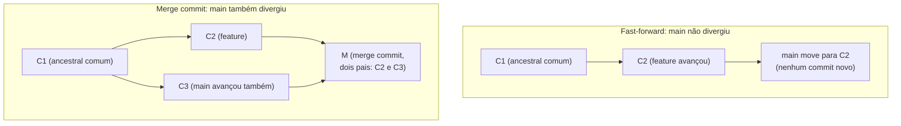

# TOPIC-003 — Merge: unindo histórias de trabalho

## Antes de começar

Na Aula 02 você viu que uma branch é só uma referência apontando para um commit, e que trocar de branch é barato porque nada é copiado. Agora você vai ver a primeira operação que realmente **junta** o trabalho de duas branches: o `merge`. Ao final desta aula, você vai conseguir executar um merge, prever se ele vai ser um simples "andar o ponteiro" (fast-forward) ou se vai criar um commit novo de integração (merge commit), e ler o histórico resultante para explicar por que ele tomou aquela forma.

Reserve cerca de 60 a 75 minutos, com um terminal aberto ao lado. Você vai produzir dois cenários de merge reais (um fast-forward, um com merge commit) e uma explicação de por que cada um se comportou daquele jeito.

## Sua sessão de estudo

- [ ] Recuperar o que já sabe sobre branches e fast-forward (10 min)
- [ ] Estudar merge commit, fast-forward merge e ancestral comum (20 min)
- [ ] Praticar um merge fast-forward e um merge com commit de merge (25 min)
- [ ] Ler o histórico resultante com `git log --graph` e explicar o porquê (15 min)

## O que você vai aprender

Ao final desta aula, você vai conseguir:

- executar um merge e distinguir um *fast-forward merge* de um merge que cria um *merge commit*;
- ler o histórico resultante de um merge com `git log --graph`, explicando por que ele tomou aquela forma, incluindo o papel do ancestral comum (*merge base*).

## Começando do zero

Merge é a operação que responde a uma pergunta muito prática: "eu tenho duas branches que andaram em paralelo — como eu junto o trabalho das duas em uma só?" Você já sabe, da Aula 02, que uma branch é apenas uma referência que aponta para um commit. Um merge pega duas dessas referências e produz um resultado que contém o trabalho das duas.

Existem dois resultados possíveis para um merge, e a diferença entre eles costuma confundir quem está começando:

### Vocabulário desta aula

- **Merge:** a operação que une o histórico de duas branches em um resultado só, trazendo para a branch atual o trabalho feito em outra branch.
- **Ancestral comum (merge base):** o commit mais recente que existe nas duas branches ao mesmo tempo — o ponto exato em que elas "se separaram" antes de divergir.
- **Fast-forward merge:** o caso em que a branch atual não recebeu nenhum commit novo desde que a outra branch se separou dela. Nesse caso, unir as duas é só mover o ponteiro da branch atual para a frente, até o commit mais recente da outra branch — nenhum commit novo é criado.
- **Merge commit:** o caso em que as duas branches realmente divergiram (cada uma recebeu commits novos depois do ancestral comum). Aqui o Git precisa criar um commit novo, com **dois pais**, que representa a união das duas histórias.

## Intuição antes dos detalhes

**Analogia:** imagine duas pessoas editando o mesmo documento colaborativo, cada uma numa cópia própria a partir do mesmo ponto de partida. Se só uma pessoa mexeu no documento enquanto a outra não tocou em nada, "juntar" as duas cópias é simples: você só adota a versão de quem mexeu — não existe nada para combinar. Mas se as duas mexeram, cada uma em partes diferentes, juntar as duas exige criar uma versão nova que incorpore as mudanças de ambas.

**Onde a analogia ajuda:** o primeiro caso é exatamente o fast-forward — só uma "linha" avançou, então adotar o resultado dela é suficiente, sem criar nada novo. O segundo caso é o merge commit — as duas linhas de trabalho avançaram de formas diferentes, e é preciso um "commit de reconciliação" que aponte para as duas.

**Onde a analogia deixa de funcionar:** juntar dois documentos editados por pessoas diferentes normalmente exige decidir manualmente o que fica de cada versão quando as duas mexeram na mesma parte — isso é um **conflito**, e é assunto da Aula 05. Nesta aula, os cenários trabalhados não têm conflito: as mudanças das duas branches não colidem, então o Git consegue combinar tudo sozinho, sem pedir sua intervenção.

## Recupere o que já sabe

Antes de seguir, sem consultar nada:

1. Da Aula 02: o que significa "fast-forward" no contexto de mover uma branch?
2. Se duas branches nunca receberam nenhum commit novo desde que uma foi criada a partir da outra, qual das duas você acha que "está na frente"?

## Conteúdo essencial

### Como o Git decide entre fast-forward e merge commit

Quando você roda `git merge outra-branch` estando na branch `main`, o Git primeiro localiza o **ancestral comum** entre `main` e `outra-branch` — o commit mais recente presente nas duas. A partir daí, existem dois casos:

**Caso 1 — Fast-forward.** Se `main` não recebeu nenhum commit novo desde que `outra-branch` foi criada (ou seja, `main` ainda está exatamente no ancestral comum), o Git simplesmente move o ponteiro de `main` para o mesmo commit que `outra-branch` aponta. Nenhum commit novo é criado; o histórico continua sendo uma linha reta.

<!-- open-study-path:outcome LO-1 -->

**Caso 2 — Merge commit.** Se `main` também recebeu commits novos depois do ancestral comum (ou seja, as duas branches divergiram de verdade), o Git não pode simplesmente mover um ponteiro — isso perderia os commits que só existem na outra linha. Em vez disso, o Git cria um **novo commit**, que aponta para **dois pais**: o commit mais recente de `main` e o commit mais recente de `outra-branch`. Esse novo commit representa "o estado combinado das duas histórias" e passa a ser o novo commit apontado por `main`.

Repare que, nos dois casos, nenhum commit da branch mesclada é apagado ou reescrito — merge sempre soma trabalho, nunca descarta commits que já existiam.

### Lendo o histórico resultante

Depois de um merge, `git log --oneline --graph --all` mostra a forma real do histórico. Em um fast-forward, você vê uma linha reta — como se o merge nunca tivesse acontecido, porque de fato nenhum commit novo foi criado especificamente para ele. Em um merge com merge commit, você vê duas linhas se juntando visualmente em um ponto, representando o commit com dois pais.

Isso significa que o histórico "conta a história de verdade": se você vê um merge commit no grafo, sabe que houve divergência real entre as branches naquele ponto. Se não vê nenhum merge commit numa integração, é porque foi um fast-forward — não porque o merge "não aconteceu de verdade".

<!-- open-study-path:outcome LO-2 -->

## Mapa visual

O diagrama abaixo mostra os dois casos lado a lado: um fast-forward (à esquerda) e um merge com merge commit (à direita).

No caso da esquerda, `main` estava parada em `C1`; como `feature` simplesmente andou para `C2`, mover `main` para `C2` é só andar o ponteiro — daí o nome fast-forward. No caso da direita, `main` também tinha avançado (para `C3`) depois do ancestral comum `C1`; como as duas linhas divergiram, o Git precisa de um commit novo (`M`) com dois pais para representar a junção. O que este diagrama não mostra é o que acontece quando as duas branches mudam **a mesma linha do mesmo arquivo** — isso gera um conflito que o Git não consegue resolver sozinho, e é o assunto da Aula 05.

## Exemplos trabalhados

### Exemplo 1 — Um fast-forward simples

**Situação:** você está na branch `main`, no commit `C1`. Você cria `git switch -c feature`, faz um commit novo (`C2`) na branch `feature`, e **não** faz nenhum commit novo em `main` nesse meio tempo. Depois, você volta para `main` (`git switch main`) e roda `git merge feature`.

**Mecanismo:** o Git verifica o ancestral comum entre `main` e `feature` — que é o próprio `C1`, já que `main` não se moveu. Como `main` não recebeu nenhum commit novo desde então, o Git conclui que pode apenas mover o ponteiro de `main` para `C2`.

**Consequência:** depois do merge, `main` aponta para `C2`, exatamente como `feature`. Nenhum commit novo foi criado. `git log --oneline --graph` mostra uma única linha reta passando por `C1` e `C2`.

**Como verificar:** rode `git log --oneline --graph --all` antes do merge (você verá `main` parado em `C1` e `feature` em `C2`) e depois do merge (você verá as duas referências apontando para `C2`, numa linha reta). O terminal também costuma exibir a mensagem `Fast-forward` durante o merge, confirmando o caminho tomado.

**Limite:** este exemplo só funciona porque `main` ficou parada. Se alguém tivesse feito qualquer commit em `main` nesse meio tempo, o resultado seria o do Exemplo 2, não este.

### Exemplo 2 — Um merge que precisa de merge commit

**Situação:** a partir do mesmo ponto `C1`, você cria `feature` e faz um commit `C2` nela — mas, dessa vez, alguém também faz um commit `C3` diretamente em `main` (por exemplo, uma correção separada), antes de você rodar o merge. Você volta para `main` e roda `git merge feature`.

**Mecanismo:** o Git verifica o ancestral comum, que ainda é `C1`. Mas agora `main` não está mais parada em `C1` — ela avançou para `C3`. Como as duas branches têm commits novos que a outra não tem (`C2` só existe em `feature`, `C3` só existe em `main`), um fast-forward é impossível: mover o ponteiro de `main` diretamente para `C2` faria `C3` "desaparecer" da branch. Por isso o Git cria um merge commit `M`, com `C3` e `C2` como pais.

**Consequência:** `main` agora aponta para `M`. `git log --oneline --graph` mostra duas linhas que partem de `C1`, uma passando por `C3` e outra por `C2`, se juntando visualmente em `M`.

**Como verificar:** rode `git log --oneline --graph --all` e observe o ponto onde as duas linhas se encontram — esse é `M`. Rode `git cat-file -p M` (usando a técnica da Aula 01) e observe que ele tem **duas linhas `parent`**, uma para cada branch de origem — diferente de todo commit que você inspecionou nas Aulas 01 e 02, que tinha só uma.

**Ambiguidade comum:** é tentador achar que "o merge criou um commit porque as mudanças eram diferentes arquivos" — mas o motivo real é a **divergência de histórico** (as duas branches avançaram separadamente), não o conteúdo específico das mudanças. Mesmo que `C2` e `C3` mexessem em arquivos completamente diferentes e sem nenhum conflito, o merge commit ainda seria necessário, porque o histórico das duas branches já tinha se separado.

## Erros comuns e como corrigir

- **"Todo merge cria um commit de merge."** Incorreto — um fast-forward não cria nenhum commit novo; ele só move o ponteiro da branch. Merge commit só acontece quando as duas branches realmente divergiram.
- **"Merge apaga os commits da branch que não virou a 'principal'."** Incorreto — merge sempre soma histórico. Depois de um merge com merge commit, os commits das duas branches originais continuam no histórico, alcançáveis a partir do commit resultante.
- **"Se o merge não pediu para resolver conflito, é porque não houve merge de verdade."** Incorreto — a ausência de conflito só significa que as mudanças não colidiram na mesma linha do mesmo arquivo. Isso não impede que um merge commit real (com dois pais) tenha sido criado.
- **"O ancestral comum é sempre o primeiro commit do repositório."** Incorreto — o ancestral comum é o commit mais recente compartilhado pelas duas branches específicas envolvidas no merge, que pode ser bem mais recente que o primeiro commit do projeto inteiro.

## Prática guiada

Em um repositório de teste (pode reaproveitar o das Aulas 01 e 02, ou criar um novo com pelo menos um commit em `main`):

1. Crie uma branch nova (`git switch -c feature`) e faça um commit nela, **sem** commitar nada em `main` nesse meio tempo.
   - *Dica:* confirme com `git log --oneline --graph --all` que `main` ficou parada e `feature` avançou.
2. Volte para `main` (`git switch main`) e rode `git merge feature`. Observe a mensagem que o terminal mostra.
   - *Dica:* a mensagem deve mencionar `Fast-forward`. Se não mencionar, revise o passo 1 — provavelmente `main` recebeu algum commit sem você perceber.
3. Crie uma nova branch (`git switch -c feature2`), faça um commit nela, volte para `main` e faça **outro** commit diretamente em `main` antes de mesclar.
   - *Dica:* a ordem importa: primeiro o commit em `feature2`, depois o commit em `main`, só então o merge.
4. Rode `git merge feature2` a partir de `main` e observe a mensagem (deve abrir um editor pedindo uma mensagem de merge commit, ou usar uma mensagem padrão).
   - *Dica:* rode `git log --oneline --graph --all` antes e depois — compare a forma do grafo com o Exemplo 2 desta aula.

Não avance até conseguir apontar, no seu terminal, qual dos dois merges foi fast-forward e qual criou um merge commit, e explicar por quê usando o conceito de ancestral comum.

## Prática independente

Crie dois cenários de merge do zero, em um repositório de teste novo ou reaproveitado:

1. Um cenário onde o merge resulta em fast-forward.
2. Um cenário onde o merge resulta em merge commit (as duas branches precisam ter avançado separadamente a partir do ancestral comum).

Para cada cenário, capture a saída de `git log --oneline --graph --all` antes e depois do merge, e escreva uma explicação (4 a 8 frases) de por que cada merge se comportou daquele jeito, citando o papel do ancestral comum em cada caso.

## Outras formas de aprender

- **Interativo — Learn Git Branching:** o mesmo ambiente das Aulas 01 e 02 tem uma seção específica de merge, que mostra visualmente o grafo se formando a cada operação (learngitbranching.js.org) — útil para ver o merge commit de dois pais se formando sem precisar decorar a saída de texto.
- **Leitura oficial aprofundada:** o capítulo "Basic Branching and Merging" do Pro Git (link na tabela abaixo) detalha o mesmo processo com mais exemplos de linha de comando — vá além apenas se quiser mais repetição antes da Aula 05.

## Confira sem consultar

Sem olhar o restante da aula, responda:

1. Com suas próprias palavras: o que precisa ser verdade sobre o ancestral comum para um merge virar fast-forward, em vez de criar um merge commit?
2. Um merge commit tem quantos commits "pai"? O que cada um deles representa?

Se errar qualquer uma, volte apenas ao trecho relacionado ("Como o Git decide entre fast-forward e merge commit") e tente responder de novo sem consultar.

## O que você vai produzir

O entregável desta etapa são os dois cenários (fast-forward e merge commit) descritos na "Prática independente": a saída de `git log --oneline --graph --all` de cada um, acompanhada da sua explicação escrita de por que cada um se comportou daquele jeito. Cole tudo no campo de evidência do formulário de avaliação.

## Avaliação

Abra a avaliação direto por aqui: https://github.com/diegomoura/open-study-path-agent-test-20260831211026/issues/new?template=assessment-topic-003.yml

Depois de enviar suas respostas, volte ao chat e escreva:

`Terminei Merge: unindo histórias de trabalho. Avalie minhas respostas.`

## Como este conteúdo foi construído

A distinção entre fast-forward merge e merge commit, e o papel do ancestral comum (merge base), seguem o capítulo "Basic Branching and Merging" do Pro Git e a documentação oficial de `git-merge`, ambos consultados para esta aula. A analogia do documento colaborativo editado por duas pessoas, os dois exemplos passo a passo e o diagrama Mermaid com os dois cenários lado a lado são adaptações pedagógicas criadas especificamente para esta trilha, considerando que você já chegou com a intuição correta de que "merge cria um commit de merge" — esta aula formaliza quando isso é verdade e quando não é.

## Fontes e caminhos para aprofundar

| Tipo | Fonte | Como foi usada nesta aula | Acesso |
| --- | --- | --- | --- |
| Primária / oficial | Chacon, S.; Straub, B. *Pro Git*, capítulo 3 "Git Branching — Basic Branching and Merging" — https://git-scm.com/book/en/v2/Git-Branching-Basic-Branching-and-Merging | Base da distinção entre fast-forward merge e merge commit, e do papel do ancestral comum | público, gratuito |
| Referência técnica oficial | Documentação oficial `git-merge` — https://git-scm.com/docs/git-merge | Conferência do comportamento exato do comando e dos dois casos (fast-forward vs. merge commit) | público, gratuito |
| Explicação confiável | GitHub Docs, "About pull request merges" — https://docs.github.com/en/pull-requests/collaborating-on-pull-requests/incorporating-changes-from-a-pull-request/about-pull-request-merges | Conferência de como fast-forward e merge commit aparecem também no contexto de merges feitos via pull request | público, gratuito |
| Complementar / interativo | Learn Git Branching — https://learngitbranching.js.org/ | Visualização interativa do grafo de merge se formando, sugerida como prática opcional adicional | público, gratuito |
