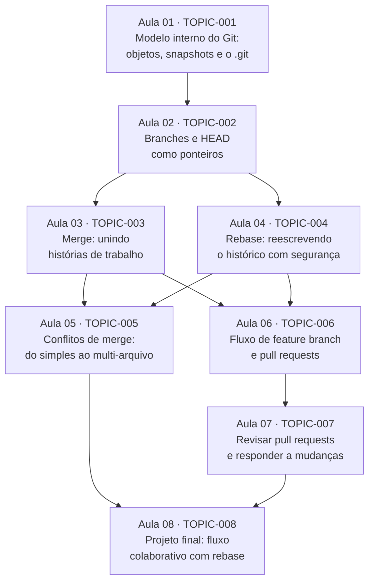

# Trilha: Fundamentos de Git e GitHub

Bem-vindo(a). Esta trilha foi montada a partir do que você contou no intake e do que apareceu no seu diagnóstico. Você já usa `git add`, `git commit`, `git push` e `git pull` com conforto no dia a dia — por isso a trilha **não volta a ensinar esses comandos do zero**. Ela começa exatamente onde você disse que sente falta de base: entender o que o Git guarda por baixo dos panos, perder o medo de `rebase` e de conflitos, e trabalhar com pull requests dentro de um fluxo colaborativo de time.

O objetivo final que você declarou orienta tudo:

> Resolver um conflito de merge complexo sem entrar em pânico, e revisar/abrir pull requests com confiança em um repositório colaborativo que usa rebase e branches de feature.

O curso é fortemente **prático**, do jeito que você pediu: cada aula tem exercícios e um pequeno projeto ou laboratório, com o mínimo de teoria isolada. A teoria aparece só o suficiente para você entender *por que* um comando faz o que faz — nunca como um bloco desconectado.

## Como ler esta trilha

- A trilha é organizada por **aulas** (tópicos), não por semanas. Não há prazo fixo; você avança quando cada aula é concluída com evidência (exercícios avaliados).
- Cada aula tem um **número** (Aula 01, Aula 02...) só para ajudar na navegação. O que decide se uma aula está liberada são os **pré-requisitos diretos** listados nela, não o número.
- Termos técnicos aparecem com uma explicação curta em linguagem comum na primeira vez. Você não precisa já conhecer o vocabulário do curso para entender o que vai aprender.
- `aula pronta` = já tem lição, prática e avaliação completas. `aula futura` = já está planejada e será preparada automaticamente quando você chegar perto dela.

## Grafo de dependências das aulas

Este é o grafo real da trilha. Cada seta significa "esta aula assume que a anterior já foi dominada".

### Como o grafo funciona

- **Raiz da trilha:** a **Aula 01** é o único ponto de partida. Tudo depende, direta ou indiretamente, de você entender o que o Git realmente armazena.
- **Ramo que se abre na Aula 02:** depois de entender branches e HEAD, a trilha se divide em dois caminhos que podem ser estudados quase em paralelo — **Merge (Aula 03)** e **Rebase (Aula 04)**. Ambos partem da mesma base e se reencontram depois.
- **Ponto de convergência 1 — Aula 05 (conflitos):** resolver conflitos de verdade exige entender tanto merge quanto rebase, porque conflitos aparecem nos dois. Por isso a Aula 05 depende das Aulas 03 e 04.
- **Ponto de convergência 2 — Aula 06 (feature branch + PR):** o fluxo de time também depende de você já saber fazer merge e rebase, então a Aula 06 também converge de 03 e 04.
- **Aula 07 (revisar PRs)** depende de você já saber abrir e trabalhar PRs (Aula 06).
- **Projeto final — Aula 08:** junta os dois grandes objetivos que você declarou (conflitos complexos + revisar/abrir PRs em fluxo colaborativo), então depende da Aula 05 e da Aula 07.

Observação sobre paralelismo: assim que a Aula 02 estiver concluída, as Aulas 03 e 04 ficam disponíveis. Você pode seguir por qualquer uma primeiro — a numeração é só ordem de leitura sugerida, não uma corrente obrigatória.

## Aulas da trilha

Abaixo, o contrato de cada aula: o que você vai conseguir fazer, por que isso importa para o seu objetivo, os pré-requisitos diretos, a evidência esperada e o esforço estimado. Nenhuma lição foi materializada ainda — isto é a arquitetura aprovada da trilha.

### Aula 01 · TOPIC-001 — Modelo interno do Git: objetos, snapshots e o `.git`

- **Pré-requisitos diretos:** nenhum (raiz da trilha).
- **O que você vai conseguir fazer:** explicar o que o Git guarda quando você faz um commit (objetos: *blob* = conteúdo de um arquivo, *tree* = uma pasta, *commit* = um snapshot com metadados), e inspecionar esses objetos dentro da pasta `.git`.
- **Por que importa para você:** você disse que usa os comandos mas "nunca entendeu de verdade como funciona por baixo dos panos". Este é o alicerce que faz branches, merge, rebase e conflitos deixarem de parecer mágica.
- **Vocabulário novo apresentado aqui:** *repositório*, *objeto*, *blob*, *tree*, *commit* (como snapshot), *hash SHA*, *staging area* / *index*.
- **Evidência esperada:** exercícios em que você cria commits e usa comandos de inspeção (`git cat-file`, `git ls-tree`, `git log`) para descrever o que o Git armazenou; explicar, com suas palavras, por que um commit é um snapshot e não um "diff".
- **Esforço estimado:** ~60–75 min (3–4 atividades).

### Aula 02 · TOPIC-002 — Branches e HEAD como ponteiros

- **Pré-requisitos diretos:** Aula 01.
- **O que você vai conseguir fazer:** descrever tecnicamente o que é uma branch (uma referência leve que aponta para um commit) e o que é o `HEAD` (onde você está agora), e prever o que muda ao criar, trocar e apagar branches.
- **Por que importa para você:** seu diagnóstico mostrou intuição correta ("branch é um ponteiro"), mas faltava a mecânica formal ligando branch, HEAD e commits. Sem isso, rebase e conflitos ficam confusos.
- **Vocabulário novo apresentado aqui:** *referência* / *ref*, *HEAD*, *fast-forward*, *detached HEAD*.
- **Evidência esperada:** exercícios em que você inspeciona para onde branches e HEAD apontam (`git log --oneline --graph`, `.git/refs`), cria/troca branches e explica o efeito de cada operação nos ponteiros.
- **Esforço estimado:** ~45–60 min (3–4 atividades).

### Aula 03 · TOPIC-003 — Merge: unindo histórias de trabalho

- **Pré-requisitos diretos:** Aula 02.
- **O que você vai conseguir fazer:** executar um merge, distinguir *fast-forward* de *merge com commit de merge*, e ler o histórico resultante para entender o que aconteceu.
- **Por que importa para você:** merge é a base do trabalho em equipe e o ponto de partida para entender conflitos. Você já teve intuição correta sobre "merge cria um commit de merge"; aqui isso vira prática segura.
- **Vocabulário novo apresentado aqui:** *merge*, *merge commit*, *fast-forward merge*, *ancestral comum (merge base)*.
- **Evidência esperada:** exercícios criando cenários de merge (fast-forward e não-fast-forward) e explicando, a partir do grafo de commits, por que cada um se comportou daquele jeito.
- **Esforço estimado:** ~60–75 min (3–4 atividades).

### Aula 04 · TOPIC-004 — Rebase: reescrevendo o histórico com segurança

- **Pré-requisitos diretos:** Aula 02.
- **O que você vai conseguir fazer:** usar `git rebase` para reaplicar seus commits sobre outra base, entender por que isso reescreve o histórico (gera novos commits/hashes) e saber quando usar e quando **não** usar rebase.
- **Por que importa para você:** este é o ponto central do seu objetivo. Você nunca usou rebase e tem só um palpite conceitual; o time novo usa rebase no dia a dia. A aula parte do zero prático, com laboratório guiado.
- **Vocabulário novo apresentado aqui:** *rebase*, *reescrever histórico*, *rebase interativo* (visão inicial), *golden rule do rebase* (não reescrever histórico já compartilhado).
- **Evidência esperada:** exercícios em que você rebaseia uma branch de feature sobre uma branch atualizada, compara o histórico antes/depois e justifica quando o rebase é apropriado ou perigoso.
- **Esforço estimado:** ~75–90 min (4–5 atividades).

### Aula 05 · TOPIC-005 — Conflitos de merge: do simples ao multi-arquivo

- **Pré-requisitos diretos:** Aula 03, Aula 04.
- **O que você vai conseguir fazer:** resolver conflitos com método — ler os marcadores `<<<<<<< ======= >>>>>>>`, entender qual lado é qual, resolver conflitos em **múltiplos arquivos ao mesmo tempo**, tanto em merge quanto em rebase, e verificar o resultado antes de finalizar.
- **Por que importa para você:** é o medo que você declarou explicitamente. Você já resolveu um conflito simples (um arquivo); aqui você sobe de degrau, de forma guiada, até o conflito complexo que quer resolver "sem entrar em pânico".
- **Vocabulário novo apresentado aqui:** *marcadores de conflito*, *ours* vs *theirs*, *abortar* (`--abort`) vs *continuar* (`--continue`), *rerere* (menção introdutória).
- **Evidência esperada:** um laboratório com conflito multi-arquivo (em merge e em rebase) que você resolve, verifica e explica; descrever um procedimento pessoal de "como não entrar em pânico" quando aparece um conflito.
- **Esforço estimado:** ~75–90 min (4–5 atividades).

### Aula 06 · TOPIC-006 — Fluxo de feature branch e pull requests

- **Pré-requisitos diretos:** Aula 03, Aula 04.
- **O que você vai conseguir fazer:** trabalhar num fluxo de *feature branch* (branch dedicada por tarefa), manter sua branch atualizada com a principal usando merge ou rebase, e abrir pull requests bem descritos no GitHub.
- **Por que importa para você:** você já abriu PRs pequenos na sua própria branch, mas nunca dentro de um fluxo de time com branches de feature — que é exatamente o do seu novo emprego.
- **Vocabulário novo apresentado aqui:** *feature branch*, *branch principal* (`main`), *pull request*, *branch protegida*, *atualizar a branch* (merge vs rebase da main).
- **Evidência esperada:** exercícios criando uma feature branch, mantendo-a atualizada com a `main` e abrindo um pull request com boa descrição; explicar a diferença entre atualizar a branch por merge e por rebase.
- **Esforço estimado:** ~60–75 min (3–4 atividades).

### Aula 07 · TOPIC-007 — Revisar pull requests e responder a mudanças

- **Pré-requisitos diretos:** Aula 06.
- **O que você vai conseguir fazer:** revisar o PR de outra pessoa (ler o diff, comentar linha a linha, aprovar ou pedir mudanças) e, do outro lado, responder a comentários e atualizar seu próprio PR de forma limpa.
- **Por que importa para você:** seu diagnóstico apontou que você nunca fez revisão formal de PRs de terceiros; e seu objetivo declarado inclui "revisar/abrir pull requests com confiança". Esta aula introduz esse fluxo de forma guiada antes de esperar autonomia.
- **Vocabulário novo apresentado aqui:** *code review*, *diff*, *comentário em linha*, *approve* / *request changes*, *push de correções após revisão*.
- **Evidência esperada:** um exercício de revisão (comentar e decidir sobre um PR de exemplo) e um de resposta (aplicar mudanças pedidas e atualizar o PR); explicar como dar feedback útil e respeitoso.
- **Esforço estimado:** ~60–75 min (3–4 atividades).

### Aula 08 · TOPIC-008 — Projeto final: fluxo colaborativo com rebase

- **Pré-requisitos diretos:** Aula 05, Aula 07.
- **O que você vai conseguir fazer:** conduzir, de ponta a ponta, um cenário realista de time: criar feature branches, manter-se atualizado com rebase, abrir e revisar PRs, e resolver um conflito complexo que surge no caminho — sem entrar em pânico.
- **Por que importa para você:** este projeto reúne exatamente os dois resultados que você quer levar para o novo time, num único fluxo integrado. É a prova de que a trilha atingiu seu objetivo.
- **Vocabulário novo apresentado aqui:** consolidação; nenhum termo novo — integração dos anteriores.
- **Evidência esperada:** um projeto guiado (repositório de simulação) em que você executa o ciclo completo e documenta as decisões (quando rebaseou, como resolveu o conflito, que feedback deu na revisão).
- **Esforço estimado:** ~90 min (projeto integrador; pode ser dividido em sessões).

## Esforço total estimado

Somando as aulas, a trilha leva aproximadamente **8h30 a 10h30 de estudo ativo**, distribuídas em 8 aulas. Não há semanas fixas: como você não informou uma restrição de tempo, o ritmo é seu. Cada aula só é considerada concluída quando os exercícios enviados comprovam o domínio.

## Escopo e limites

- Esta é uma trilha de **fundamentos sólidos com foco prático**, direcionada ao seu objetivo de time (rebase, feature branches, conflitos, revisão de PR). Ela cobre o que você pediu no intake por completo.
- Ela **não** cobre tópicos avançados fora do seu pedido, como submódulos, `git bisect`, hooks avançados, estratégias de branching de larga escala (GitFlow completo) ou automação de CI/CD. Se algo disso virar necessidade, pode ser adicionado depois como extensão.
- A trilha assume seu uso diário confortável de `add/commit/push/pull` (confirmado no diagnóstico) e não reensina esses comandos isoladamente — eles reaparecem apenas dentro dos exercícios práticos.

## Status atual

Arquitetura da trilha aprovada. Nenhuma aula, avaliação ou tarefa externa foi criada ainda — isso acontece na próxima etapa.
