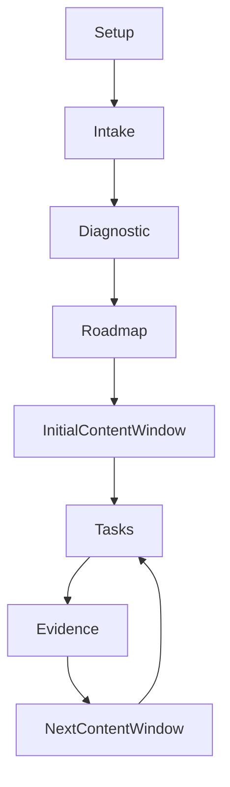
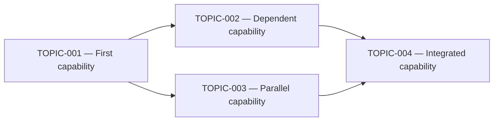

# Study Roadmap

This file is created in an Open Study Path instance after setup. The complete topic graph is generated after approved intake and diagnostic assessment. Detailed lessons may be materialized progressively according to `.open-study-path/instance.yml`.

## Lifecycle before curriculum generation

This initial diagram explains the template lifecycle only. When the curriculum is generated, retain lifecycle context only when useful and add a separate Mermaid diagram containing the actual `TOPIC-000` identifiers and their prerequisite edges.

## Topic dependency graph

Replace the example below with the real approved topic graph. Every topic must appear, and every prerequisite relationship must be represented by a directed edge.

After the diagram, explain root topics, parallel branches, convergence points and which topics are currently materialized. Do not leave a generic placeholder graph in an approved curriculum.

## Current status

The instance is configured, but no learning path has been generated yet.

## Generation rules

- The complete dependency graph and every topic contract are planned upfront.
- The approved roadmap includes a Mermaid visualization of the real topic dependencies.
- Detailed modules and assessments may use an adaptive rolling window.
- Topics are the structural planning unit.
- The intake does not define a structured weekly schedule, but it may preserve an optional free-text time constraint.
- A time constraint may influence priority and feasibility guidance, but it must not silently remove mastery-required content or redefine partial coverage as course completion.
- Without an explicit learner request for a calendar projection, show total effort and effort per topic instead of fixed weeks, weekly tables or week-numbered groups.
- Activities normally take 10–25 minutes and topics normally take 45–90 minutes.
- A topic is complete only after verified evidence satisfies its mastery criteria.

An explicitly requested optional dated or weekly projection must collect the minimum missing scheduling details, preserve topics as the canonical structure and include:

`<!-- open-study-path:calendar-projection explicitly_requested=true -->`

## Materialization status

When the curriculum exists, list every topic with one content state:

- `materialized` — module, rubric and assessment form are ready;
- `planned` — approved contract exists and detailed content will be generated automatically when the topic enters the active window.
