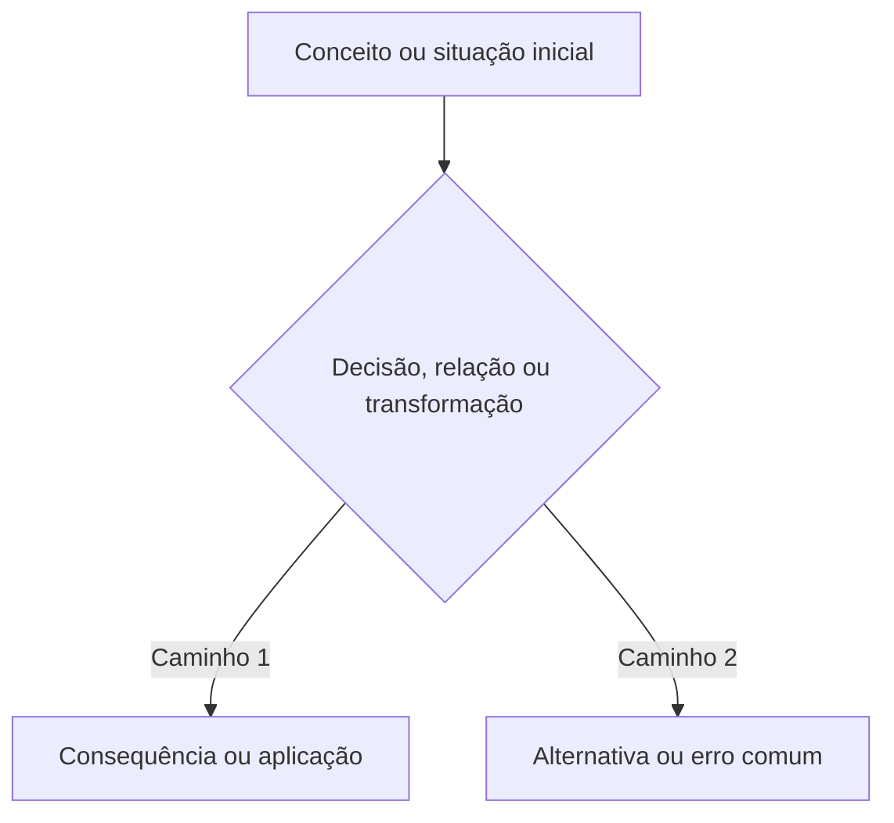

# TOPIC-000 — Replace me

<!-- Metadados operacionais desta aula ficam no frontmatter de study/topics/TOPIC-000.md. Não adicione frontmatter YAML a este arquivo. -->

## Antes de começar

Explique em poucas linhas o que a pessoa vai aprender, por que isso importa para o objetivo dela, quanto tempo reservar e o que produzir ao final. Este arquivo deve ser uma aula autocontida, não apenas uma lista de tarefas.

## Sua sessão de estudo

Divida a experiência em três a sete ações pequenas e verificáveis. Cada ação deve normalmente durar entre 10 e 25 minutos. Os tempos são sugestões, não limites rígidos.

- [ ] Recuperar o que já sei (10 min)
- [ ] Construir a intuição e estudar a ideia central (20 min)
- [ ] Refazer exemplos e prática guiada (15 min)
- [ ] Produzir a evidência independente (15 min)

## O que você vai aprender

Ao final, você deverá conseguir:

- explicar o conceito central com palavras próprias;
- aplicar o conceito a uma situação nova;
- reconhecer erros ou interpretações comuns;
- produzir a evidência exigida pela etapa.

<!-- open-study-path:outcome LO-1 -->
<!-- Posicione exatamente um marcador oculto para cada learning_outcome do contrato ao lado do conteúdo que realmente o ensina. O marcador não substitui a explicação e será conferido pelo revisor de curso. -->

## Começando do zero

Para tópicos iniciantes ou lacunas registradas no diagnóstico, explique primeiro o objeto estudado em linguagem comum. Não comece pelo mecanismo interno. Diferencie experiência em uma área adjacente de conhecimento no assunto: use a experiência prévia para escolher exemplos, não para pular fundamentos.

Expanda siglas na primeira ocorrência visível e defina os termos necessários antes de usá-los para definir outros termos. Quando a dificuldade não for iniciante e o diagnóstico confirmar domínio do vocabulário, esta seção pode ser mais curta, mas termos novos ainda devem ser definidos na primeira ocorrência.

### Vocabulário desta aula

Liste somente os termos indispensáveis à aula atual.

- **Conceito:** o que é, para que serve e com qual conceito próximo não deve ser confundido.

## Intuição antes dos detalhes

Use uma analogia quando ela realmente ajudar. Declare a relação útil e o limite para impedir que a pessoa confunda a comparação com o mecanismo real.

**Analogia:** descreva uma comparação cotidiana ou familiar.

**Onde a analogia ajuda:** explique qual relação ela torna mais fácil de perceber.

**Onde a analogia deixa de funcionar:** explique o que o sistema real faz de maneira diferente.

Quando uma analogia for artificial ou enganosa, substitua-a por um exemplo concreto rotulado.

## Recupere o que já sabe

Inclua duas ou três perguntas curtas ou tarefas de recuperação ativa. Dê orientação clara para revisar somente os pré-requisitos diretos quando necessário. Não faça perguntas que pressuponham termos ainda não explicados.

## Conteúdo essencial

Ensine efetivamente o conteúdo em linguagem adequada ao nível configurado. Inclua definições, relações entre conceitos, limites, nuances e raciocínio. Não use placeholders como “estude o conceito”.

Escreva uma ideia principal por parágrafo. Apresente primeiro a frase simples e depois o termo técnico. Coloque exemplos logo depois de abstrações difíceis e diferencie claramente fonte, síntese do agente e cenário pedagógico.

## Mapa visual

Introduza o que o diagrama representa e por que ele ajuda. Todo módulo pronto deve conter ao menos um diagrama Mermaid útil e explicado.

Depois do diagrama, explique o que observar, como as partes se relacionam e quais limitações o desenho não mostra.

## Exemplos trabalhados

Apresente ao menos dois exemplos resolvidos passo a passo:

- um caso simples ou cotidiano que ajude a reconhecer o conceito;
- um caso ligado ao domínio da trilha;
- entre eles, inclua ambiguidade, limite ou erro comum.

Estruture cada exemplo com situação, mecanismo ou decisão, consequência, forma de verificar e limite ou alternativa. Um cenário inventado deve ser chamado de **cenário realista**, não de caso real.

## Erros comuns e como corrigir

Liste equívocos prováveis, explique por que falham e mostre como reformular o raciocínio.

## Prática guiada

Inclua exercícios com pistas graduais. Não revele imediatamente a resposta completa; mostre critérios para a pessoa conferir o próprio raciocínio.

## Prática independente

Inclua tarefas que exijam transferência para um caso novo e produção do entregável definido no tópico. A prática deve desenvolver a capacidade prometida, não apenas pedir repetição de definições.

## Outras formas de aprender

Selecione somente formatos que realmente acrescentem uma perspectiva ou demonstração útil. Para cada recurso, diga por que usar, qual trecho estudar, quanto esforço exige, idioma ou legendas e condição de acesso. Recursos potencialmente pagos precisam de uma alternativa gratuita ou oficial.

## Confira sem consultar

Inclua perguntas que possam ser respondidas sem olhar o texto. Para uma aula iniciante, inclua ao menos uma pergunta de definição em linguagem própria e outra que peça aplicação ou contraste. Oriente a pessoa a voltar somente ao trecho relacionado ao erro e depois responder novamente sem consultar.

Não gere flashcards, decks Markdown, arquivos TSV ou conjuntos em serviços externos. Recuperação ativa continua dentro da aula e da avaliação.

## O que você vai produzir

Descreva exatamente o entregável e como vincular ou transcrever a evidência no formulário. Não peça dados pessoais desnecessários.

## Avaliação

Construa o link direto usando a identidade exata da instância:

`https://github.com/OWNER/REPOSITORY/issues/new?template=assessment-topic-000.yml`

Apresente como **Abrir a avaliação de <título da aula>**. Depois do envio, peça:

`Terminei <título da aula>. Avalie minhas respostas.`

Continue aceitando `Finalizei o TOPIC-000. Avalie minhas respostas.` como alias técnico.

## Como este conteúdo foi construído

Explique em um parágrafo quais fontes sustentaram as ideias centrais e quais diagramas, analogias, exemplos ou exercícios foram criados como adaptação pedagógica. Declare simplificações, divergências ou limites importantes.

## Fontes e caminhos para aprofundar

Inclua de três a sete fontes realmente consultadas. Sempre que existirem, combine uma fonte primária ou oficial, uma explicação confiável e um formato complementar útil.

| Tipo | Fonte | Como foi usada nesta aula | Acesso |
| --- | --- | --- | --- |
| Primária ou oficial | Autor, obra, seção e link direto | Base do conceito central | público / biblioteca / pago |
| Acadêmica ou técnica | Título, instituição, seção e link | Conferência de definições, evidência ou limites | público |
| Vídeo, aula ou curso | Título, autor/canal, trecho ou timestamp e link | Explicação alternativa ou demonstração | público, idioma e legendas |

Links sem explicação não bastam. Inclua capítulo, seção, página, DOI, aula, exercício ou timestamp. Não cite uma resposta de plugin como fonte; cite o documento original.
